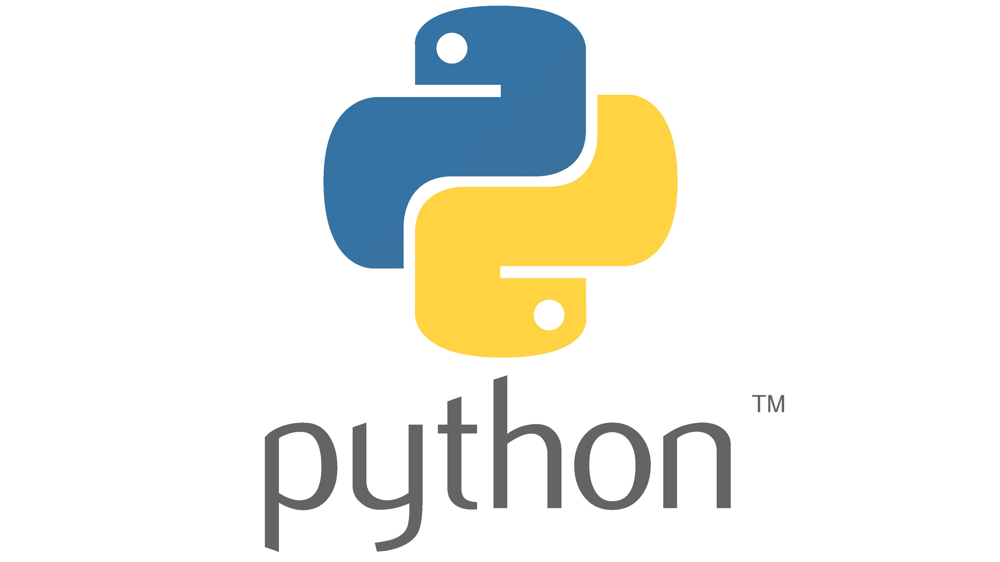
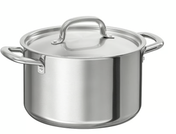
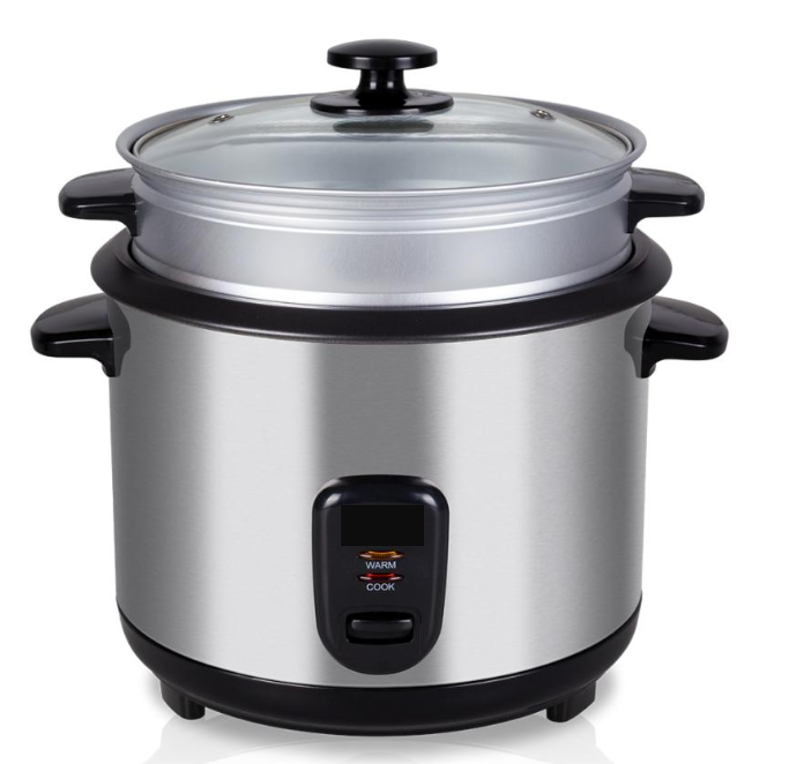

## Why R?

R is a programming language built for statistical computing

If one already knows Excel, Origin, SigmaPlot, etc. - why use R?

-   *Free* to use

-   *Large* community - support and packages

-   Analysis and visualization are *easy to replicate*

-   *Freedom* - almost anything is possible and modifiable

-   *Automation* of plotting

##  {background-image="figures/map_plots.png" background-size="60%" background-position="center"}

::: {.middle-box style="font-size: 0.85em;"}
Do we really want to do this every year by hand?

**Automation using R scripts**
:::

## Why R?

R vs python

Analogy: With what can you cook rice?

. . .

::::::: columns
:::: {.column width="50%"}
{width="25%"} {width="35%"}

::: fragment
[*Very good* rice can be cooked\
...but also any other dish too]{style="font-size: 0.75em;"}
:::
::::

:::: {.column width="50%"}
{width="15%"} {width="25%"}

::: fragment
[*Perfect* rice can be cooked\
...but very few other dishes]{style="font-size: 0.75em;"}
:::
::::
:::::::

## Why R?

Why not just {style="vertical-align: -20px;" width="15%"} & {style="vertical-align: -15px;" width="13%"} ?

::: {.fragment fragment-index="1" style="font-size: 0.75em;"}
-   People who know R get dramatically more value from AI assistants than beginners
-   AI as a copilot – you still need to know how to fly
:::

::: {.fragment data-fragment-index="2" style="font-size: 1em;"}
Other considerations
:::

::: {.fragment data-fragment-index="2" style="font-size: 0.75em;"}
-   R script is a reproducible record of what was done with data. AI conversation is not.
:::

. . .

::: {.callout-important title="ARIS and FAIR data" style="--callout-color: black;" appearance="simple"}
Open access to all research outputs from publicly funded projects - **data analysis and visualization included**
:::

## Overview

:::: {.fragment data-fragment-index="0"}
(1) R and R studio orientation

(2) Creating and using objects

(3) Packages

(4) Basic visualization

(5) Basic analyses

(6) Demonstration on a precipitation isotopes dataset

::: {style="font-size: 0.5em; margin-top: 1em;"}
Workshop materials based on:

-   Handley Wickham, R for Data Science, https://r4ds.hadley.nz/

-   Charles Lanfear, Introduction to R, https://clanfear.github.io/Intro_R_Workshop/
:::
::::

::: {style="text-align: center; color: white;" background-color="#000000"}
# (1) R and R studio orientation
:::
