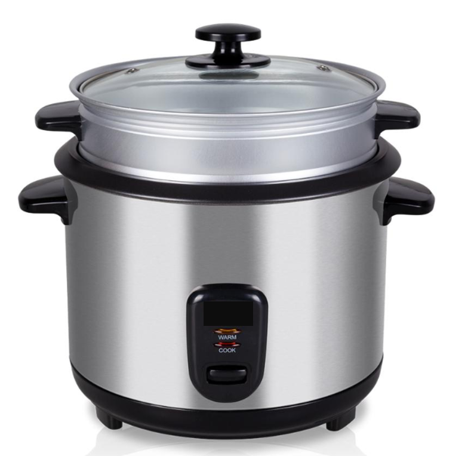
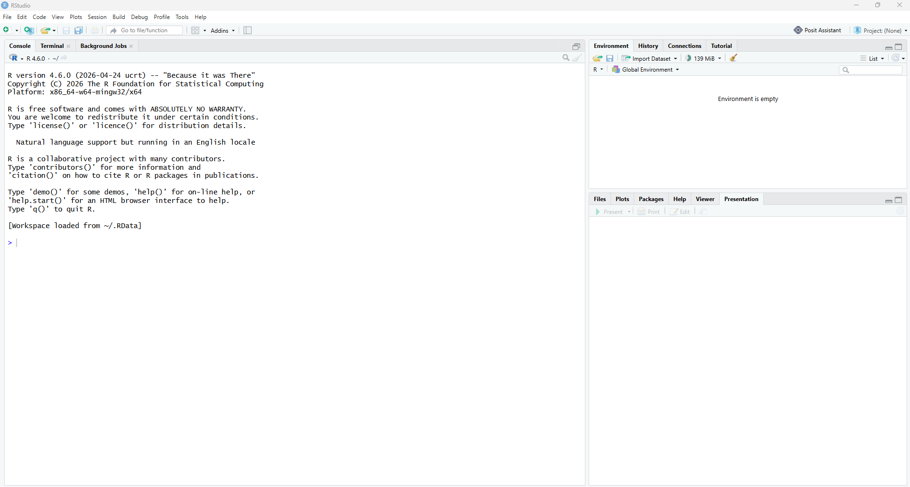
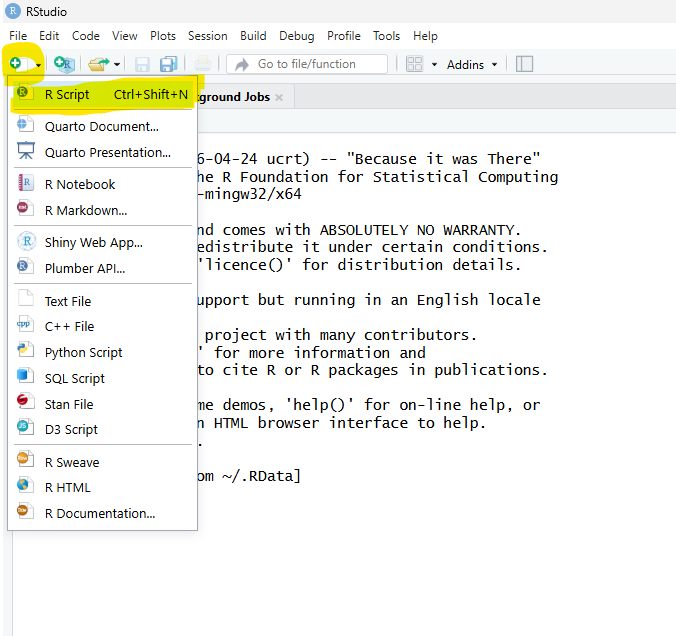
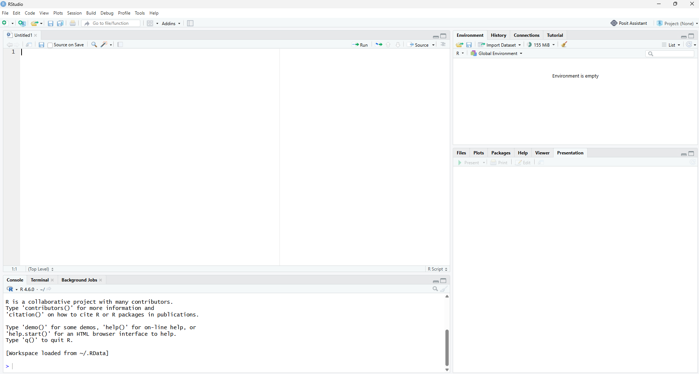

## Why R?

R is a programming language built for statistical computing

If one already knows Excel, Origin, SigmaPlot, etc. - why use R?

- *Free* to use

- *Large* community - support and packages

- Analysis and visualization are *easy to replicate*

- *Freedom* - almost anything is possible and modifiable

- *Automation* of plotting

##  {background-image="figures/map_plots.png" background-size="60%" background-position="center"}

::: {.middle-box style="font-size: 0.85em;"}
Do we really want to do this every year by hand?

**Automation using R scripts**
:::

## Why R?

R vs python

Analogy: With what can you cook rice?

. . .

::::::: columns
:::: {.column width="50%"}
{width="25%"} {width="35%"}

::: fragment
[*Very good* rice can be cooked\
...but also any other dish too]{style="font-size: 0.75em;"}
:::
::::

:::: {.column width="50%"}
{width="15%"} {width="25%"}

::: fragment
[*Perfect* rice can be cooked\
...but very few other dishes]{style="font-size: 0.75em;"}
:::
::::
:::::::

## Why R?

Why not just {style="vertical-align: -20px;" width="15%"} & {style="vertical-align: -15px;" width="13%"} ?

::: {.fragment fragment-index="1" style="font-size: 0.75em;"}
- People who know R get dramatically more value from AI assistants than beginners
- AI as a copilot – you still need to know how to fly
:::

::: {.fragment data-fragment-index="2" style="font-size: 1em;"}
Other considerations
:::

::: {.fragment data-fragment-index="2" style="font-size: 0.75em;"}
- R script is a reproducible record of what was done with data. AI conversation is not.
:::

. . .

::: {.callout-important title="ARIS and FAIR data" style="--callout-color: black;" appearance="simple"}
Open access to all research outputs from publicly funded projects - **data analysis and visualization included**
:::

## Workshop overview

:::: {.fragment data-fragment-index="0"}
(1) Introduction to R

(2) Data visualization

(3) Data transformation

(4) Data tidying

(5) Projects and data import

(6) Demonstration on an example project

::: {style="font-size: 0.5em; margin-top: 1em;"}
Workshop materials based on:

- Hadley Wickham, R for Data Science, https://r4ds.hadley.nz/

- Charles Lanfear, Introduction to R, https://clanfear.github.io/Intro_R_Workshop/
:::
::::

##  {.transition-slide background-color="#444444"}

::: transition-title
1\) R and R studio orientation
:::

## RStudio

RStudio is a user-friendly application that gives a visual interface for writing, editing, and running R code.

. . .

::: {style="margin-top: 1.3em;"}
RStudio can:
:::

::: {style="font-size:70%;"}
- Write & run R code with helpful features like auto-complete and syntax highlighting
- Enables viewing created objects (tables, graphs)
- Files, code, graphs, outputs → all in one window
:::

## RStudio

This is how RStudio looks when opened for the first time:



## RStudio

We should open a new R script the following way:



## RStudio

Finally, we have the 4 RStudio windows open, let's explain what is what

::: {style="position: relative;"}
{width="80%"}

::: {.fragment data-fragment-index="1" style="position: absolute; top: 25%; left: 15%; background: rgba(0,0,0,0.75); color: white; padding: 4px 10px; border-radius: 6px; font-size: 0.5em;"}
**Source** – write & save scripts
:::

::: {.fragment data-fragment-index="2" style="position: absolute; bottom: 7%; left: 15%; background: rgba(0,0,0,0.75); color: white; padding: 4px 10px; border-radius: 6px; font-size: 0.5em;"}
**Console** – run code, see output
:::

::: {.fragment data-fragment-index="3" style="position: absolute; top: 20%; right: 5%; background: rgba(0,0,0,0.75); color: white; padding: 4px 10px; border-radius: 6px; font-size: 0.5em;"}
**Environment/History** – objects you've created
:::

::: {.fragment data-fragment-index="4" style="position: absolute; bottom: 20%; right: 10%; background: rgba(0,0,0,0.75); color: white; padding: 4px 10px; border-radius: 6px; font-size: 0.5em;"}
**Outputs** – browse, view, look up, help
:::
:::

## Editing and running code

Three ways to run R code in RStudio:

::: {.fragment data-fragment-index="1" style="font-size: 70%;"}
1.  **Highlighting the lines in the editor window** and clicking *Run* at the top. Alternatively, <kbd>Ctrl</kbd> + <kbd>Enter</kbd> for Windows or <kbd>⌘</kbd> + <kbd>Enter</kbd> for Mac
:::

::: {.fragment data-fragment-index="2" style="font-size: 70%;"}
2.  **Clicking** anywhere on the code line (in the **editor window**) and pressing <kbd>Ctrl</kbd> + <kbd>Enter</kbd> or <kbd>⌘</kbd> + <kbd>Enter</kbd>
:::

::: {.fragment data-fragment-index="3" style="font-size: 70%;"}
3.  Typing or pasting the code directly into the **console window** and pressing <kbd>Enter</kbd>
:::

## Incomplete code

What if you mess up (e.g., forget to close brackets)?

::: {.fragment data-fragment-index="1" style="font-size: 80%;"}
- In console window, R might show <kbd>+</kbd> sign, indicating that the command has to be finished
:::

::: {.fragment data-fragment-index="1" style="font-size: 120%;"}
``` text
> 12 * (2 + 6
+
```
:::

::: {.fragment data-fragment-index="2" style="font-size: 70%;"}
- You can finish the command or hit <kbd>Esc</kbd> to get out of it
:::

## R as a calculator

In the console, type <kbd>12 + 34 + 56</kbd> and hit <kbd>Enter</kbd>.

::: {.fragment data-fragment-index="1" style="font-size: 70%;"}
- The outcome should look like this:
:::

::: {.fragment data-fragment-index="1" style="font-size: 120%;"}
```{r}
#| echo: true
12 + 34 + 56
```
:::

::: {.fragment data-fragment-index="2" style="font-size: 70%;"}
- The <kbd>\[1\]</kbd> indicates the numeric index of the first element in that line
:::

::: {.fragment data-fragment-index="3"}
In your editor window, try typing the line <kbd>sqrt(400)</kbd> and running it by <kbd>Ctrl</kbd> + <kbd>Enter</kbd> or <kbd>⌘</kbd> + <kbd>Enter</kbd>
:::

::: {.fragment data-fragment-index="4" style="font-size: 120%;"}
```{r}
#| echo: true
sqrt(400)
```
:::

## Functions and help

<kbd>sqrt()</kbd> was an example of a **function** in R. To see more details about what each function does, type <kbd>?</kbd> before the function.

::: {style="font-size: 120%;"}
```{r}
#| echo: true
#| eval: false
?sqrt
```
:::

::: {.fragment data-fragment-index="1" style="font-size: 80%; margin-top: 1.5em;"}
**Arguments** are inputs that are passed to a function. In the case of <kbd>sqrt()</kbd>, the only argument is <kbd>x</kbd>, which can be a number, or a vector of numbers
:::

::: {.fragment data-fragment-index="2" style="font-size: 80%;"}
Functions can get complex – documentation is your friend!
:::

## Comments in the code

By using the <kbd>\#</kbd> sign, you can create a comment, which will be ignored when you run code.

::: {.fragment data-fragment-index="1" style="font-size: 80%;"}
- Comments are useful for describing what was done:
:::

::::: {.fragment data-fragment-index="1" style="font-size: 120%;"}
::: screen-only
```{webr-r}
#| echo: true
# This calculates square root of 400
sqrt(400)
```
:::

::: print-only
```{r}
#| echo: true
# This calculates square root of 400
sqrt(400)
```
:::
:::::

::: {.fragment data-fragment-index="2" style="font-size: 80%;"}
- Comments are also useful to "comment-out" the code you want to ignore
:::

::: {.fragment data-fragment-index="2" style="font-size: 120%;"}
```{r}
#| echo: true
# This will be skipped
# sqrt(400)
```
:::

##  {.transition-slide background-color="#444444"}

::: transition-title
2\) Creating and using objects
:::

## Creating and using objects

R stores *everything* as an object - data, functions, models, output. Objects are created using the assignment operator <kbd>\<-</kbd>, shortcut for it: <kbd>Alt</kbd> + <kbd>-</kbd>

::::::::::::::: screen-only
:::::::::: swap-area
:::::: {.fragment .fade-out data-fragment-index="3"}
::::: {.fragment .fade-in data-fragment-index="1"}
::: {style="font-size: 80%;"}
- Try creating an object named <kbd>new_object</kbd>:
:::

::: {style="font-size: 120%;"}
```{r}
#| echo: true
new_object <- 144 # This stores 144 as an object
```
:::
:::::
::::::

::::: {.fragment .fade-in data-fragment-index="3"}
::: {style="font-size: 80%;"}
- Try using objects in one of the following ways:
:::

::: {style="font-size: 120%;"}
```{r}
#| echo: true
new_object + 10
new_object + new_object
sqrt(new_object)
```
:::
:::::
::::::::::

:::::: {.fragment .fade-out data-fragment-index="3"}
::::: {.fragment .fade-in data-fragment-index="2"}
::: {style="font-size: 80%;"}
- If you want to display or "call" an object, simply type its name in console
:::

::: {style="font-size: 120%;"}
```{r}
#| echo: true
new_object # This calls the contents of the object
```
:::
:::::
::::::
:::::::::::::::

:::: print-only
::: {style="font-size: 80%;"}
- Create an object, display it, and use it in calculations:
:::

```{r}
#| echo: true
new_object <- 144
new_object
new_object + 10
sqrt(new_object)
```
::::

## Data types/classes

Every object in R has a **type** (also called a **class**)

::: {.fragment data-fragment-index="1" style="font-size: 80%;"}
- **numeric** – numbers, e.g. <kbd>144</kbd>, <kbd>3.14</kbd>
- **character** – text (strings), e.g. <kbd>"Atlantic"</kbd>
- **logical** – <kbd>TRUE</kbd> / <kbd>FALSE</kbd>
- **factor** – categorical data with fixed levels, e.g. <kbd>"low"</kbd>, <kbd>"medium"</kbd>, <kbd>"high"</kbd>
:::

::: {.fragment data-fragment-index="2" style="font-size: 70%; margin-top: 1em;"}
- You can check an object's type using <kbd>class()</kbd> function:
:::

::: {.fragment data-fragment-index="2" style="font-size: 120%;"}
```{r}
#| echo: true
#| eval: true
class(new_object)
```
:::

::: {.fragment data-fragment-index="3" style="font-size: 70%;"}
- Many errors in R happen because a function expected one type and got another
:::

## Creating vectors

A **vector** is a series of elements, such as numbers or characters

::: {.fragment data-fragment-index="1" style="font-size: 70%;"}
You can create a vector and store is as an object. Creating vectors is done using the function <kbd>c()</kbd> which stands for "combine" or "concatenate":
:::

::: {.fragment data-fragment-index="1" style="font-size: 120%;"}
```{r}
#| echo: true
numeric_vector <- c(4, 9, 16, 25, 36)
numeric_vector
```
:::

::: {.fragment data-fragment-index="2" style="font-size: 70%; margin-top: 1.5em;"}
- If you name an object the same name as an existing object *it will overwrite it*
:::

::: {.fragment data-fragment-index="3" style="font-size: 70%;"}
- You can provide vectors as arguments to many functions:
:::

::: {.fragment data-fragment-index="3" style="font-size: 120%;"}
```{r}
#| echo: true
sqrt(numeric_vector)
```
:::

## Creating character vectors

::: {style="font-size: 85%;"}
We often work with categorical data. A vector of text elements (called **strings** in programming jargon) is created by putting text in quotes:
:::

::: {style="font-size: 120%;"}
```{r}
#| echo: true
string_vector <- c("Atlantic", "Pacific", "Arctic")
string_vector
```
:::

::: {.fragment data-fragment-index="1" style="font-size: 70%;"}
- Functions can also be used on character vectors, such as the <kbd>sort()</kbd> function
:::

::: {.fragment data-fragment-index="1" style="font-size: 120%;"}
```{r}
#| echo: true
sort(string_vector)
```
:::

::: {.fragment data-fragment-index="2" style="font-size: 70%;"}
- As we go on, we will see functions which accept more than just one argument, such as the <kbd>decreasing = TRUE</kbd> argument of the <kbd>sort()</kbd> function:
:::

::: {.fragment data-fragment-index="2" style="font-size: 120%;"}
```{r}
#| echo: true
sort(string_vector, decreasing = TRUE)
```
:::

## Logical vectors and comparisons

R can evaluate whether something is <kbd>TRUE</kbd> or <kbd>FALSE</kbd> using **comparison operators**:

::: {.fragment data-fragment-index="1" style="font-size: 80%;"}
- <kbd>==</kbd> equal to &nbsp;&nbsp;&nbsp; <kbd>!=</kbd> not equal to
- <kbd>\></kbd> / <kbd>\<</kbd> greater/less than
- <kbd>\>=</kbd> / <kbd>\<=</kbd> greater/less than or equal to
:::

::: {.fragment data-fragment-index="1" style="font-size: 120%;"}
```{r}
#| echo: true
numeric_vector > 20
```
:::

::: {.fragment data-fragment-index="2" style="font-size: 70%; margin-top: 1em;"}
- The result is a **logical vector** – itself a type we can store, count, or use to filter data
:::

## Logical vectors and comparisons

R can evaluate whether something is <kbd>TRUE</kbd> or <kbd>FALSE</kbd> using **comparison operators**:

::: {style="font-size: 80%;"}
- <kbd>==</kbd> equal to &nbsp;&nbsp;&nbsp; <kbd>!=</kbd> not equal to
- <kbd>\></kbd> / <kbd>\<</kbd> greater/less than
- <kbd>\>=</kbd> / <kbd>\<=</kbd> greater/less than or equal to
:::

::: {.fragment data-fragment-index="1" style="font-size: 80%;"}
- <kbd>&</kbd> (and), <kbd>\|</kbd> (or) combine multiple conditions:
:::

::: {.fragment data-fragment-index="1" style="font-size: 120%;"}
```{r}
#| echo: true
numeric_vector > 10 & numeric_vector < 30
```
:::

## Missing values

Real datasets almost always have gaps. R represents a missing value as <kbd>NA</kbd>.

::: {.fragment data-fragment-index="1" style="font-size: 120%;"}
```{r}
#| echo: true
na_vector <- c(4, 9, NA, 25, 36)
na_vector
```
:::

::: {.fragment data-fragment-index="2" style="font-size: 70%; margin-top: 1em;"}
- <kbd>NA</kbd> is "contagious" – most calculations involving <kbd>NA</kbd> return <kbd>NA</kbd>:
:::

::: {.fragment data-fragment-index="2" style="font-size: 120%;"}
```{r}
#| echo: true
sum(na_vector)
```
:::

## Missing values

Real datasets almost always have gaps. R represents a missing value as <kbd>NA</kbd>.

::: {style="font-size: 120%;"}
```{r}
#| echo: true
na_vector <- c(4, 9, NA, 25, 36)
na_vector
```
:::

::: {style="font-size: 70%;"}
- Use <kbd>is.na()</kbd> to detect missing values, and <kbd>na.rm = TRUE</kbd> to ignore them in calculations:
:::

::: {.fragment data-fragment-index="1" style="font-size: 120%;"}
```{r}
#| echo: true
is.na(na_vector)
```
:::

::: {.fragment data-fragment-index="2" style="font-size: 120%;"}
```{r}
#| echo: true
sum(na_vector, na.rm = TRUE)
```
:::

::: {.fragment data-fragment-index="2" style="font-size: 70%;"}
- Keep an eye out for <kbd>NA</kbd>s – forgetting about them is one of the most common beginner mistakes!
:::

## More complex objects

Same principles shown with vectors can be used with more complex objects, such as **matrices**, **arrays**, **lists**, and **dataframes**

::: {style="font-size: 90%;"}
- **Dataframe** is the object we will focus on the most

  ::: {.fragment style="font-size: 80%;"}
  - The same concept as an Excel table, with more defined contents
  - Can store different vector types inside it, e.g. a character column, a numeric column, a logical column, ...
  :::

:::

## Accessing data in objects

::: {style="font-size: 80%;"}
There are two main ways to access data inside objects: square brackets (<kbd>\[\]</kbd> or <kbd>\[\[\]\]</kbd>), and <kbd>\$</kbd>. How you access an object depends on its *dimensions*.
:::

::: {.fragment data-fragment-index="1" style="font-size: 80%;"}
Dataframes have *2* dimensions: **rows** and **columns**. Using square brackets we can **subset** it using the format: <kbd>object\[row, column\]</kbd>. If you leave row or column place empty, all elements in that dimension will be selected.
:::

::: {.fragment data-fragment-index="1" style="font-size: 100%;"}
```{r}
#| echo: true
penguins[2,] # Second row
```
:::

::: {.fragment data-fragment-index="2" style="font-size: 100%;"}
```{r}
#| echo: true
penguins[1:3, 3:5] # Rows 1-3 and columns 3-5
```
:::

##  {.transition-slide background-color="#444444"}

::: transition-title
3\) Packages
:::

## Installing and loading packages

Packages contain useful functions (and sometimes data) created by the community

::: {.fragment data-fragment-index="1" style="font-size: 80%;"}
- These are not included in base R

- The Comprehensive R Archive Network (CRAN): packages go through a *peer-review process by statisticians and computer scientists*
:::

::: {.fragment data-fragment-index="2"}
CRAN packages are installed using <kbd>install.packages()</kbd> – only once is needed
:::

::: {.fragment data-fragment-index="2" style="font-size: 120%;"}
```{r}
#| echo: true
#| eval: false
install.packages("tidyverse") # Run first
library("tidyverse") # Run second
```
:::

## Useful R packages

Too many to list, but <kbd>tidyverse</kbd> is by far the most useful

A package that includes a *family of packages*:

::: {.fragment data-fragment-index="1" style="font-size: 80%;"}
- <kbd>ggplot2</kbd> for *plotting*

- <kbd>dplyr</kbd> and <kbd>tidyr</kbd> for *data manipulation*

- <kbd>lubridate</kbd> for working with *dates*

- ...
:::

::: {.fragment data-fragment-index="2" style="font-size: 80%;"}
Other notable packages: <kbd>readxl</kbd> (reading Excel files), <kbd>sf</kbd> (spatial data), <kbd>tidymodels</kbd> (modelling & machine learning), <kbd>data.table</kbd> (big data handling), and many more.
:::

## Loading packages

::: {style="font-size: 90%;"}
After installation, packages have to be loaded into the environment using <kbd>library()</kbd>:
:::

::: {style="font-size: 100%;"}
```{r}
#| echo: true
library(tidyverse)
```
:::

::: {.fragment data-fragment-index="1" style="font-size: 90%;"}
Once a package is loaded, you can use functions and/or data inside them:
:::

::: {.fragment data-fragment-index="1" style="font-size: 100%;"}
```{r}
#| echo: true
data("diamonds") # Places data in your global environment
head(diamonds) # Displays first six elements of an object
```
:::
