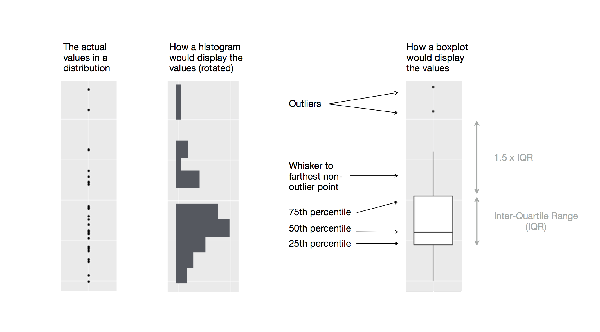

```{r}
#| label: setup
#| include: false

library(tidyverse)
library(knitr)
```

## Visualization in R

::: {style="font-size: 90%;"}

Base R includes a function for plotting - <kbd>plot()</kbd>. Nowadays, plotting in R is most commonly done with <kbd>ggplot()</kbd> function from the <kbd>tidyverse</kbd> package.

:::

:::::::: columns

::::: {.column width="60%"}

::: {.fragment data-fragment-index="1" style="font-size: 70%;"}

Benefits:

- The "**g**rammar of **g**raphics" (**gg**) is an intuitive way of building a plot (for most people)

- Layering - add geometries, stats, annotations without complete replotting

- Faceting - splitting one chart into multiple smaller parts

- Modern, publication-ready default themes

:::

:::::

::::: {.column width="40%"}

::: {.fragment data-fragment-index="2" style="font-size: 70%;"}

Cons:

- Slower than base <kbd>plot()</kbd>

- Needs "tidy" data for plotting

:::

:::::

::::::::

## Vocabulary of <kbd>ggplot()</kbd>

Data   →   Aesthetics   →   Geometry

:::::::: columns

::::: {.column width="40%"}

::: {.fragment data-fragment-index="1" style="font-size: 75%;"}

**Data**

The data used for the plot

:::

::: {.fragment data-fragment-index="1" style="font-size: 45%;"}

```{r}
#| echo: false
#| message: false
#| results: asis
penguins |>
  select(species, flipper_len, body_mass, bill_len) |>
  slice(1:5) |>
  kable(format = "html")
```
:::

:::::

::::: {.column width="30%"}

::: {.fragment data-fragment-index="2" style="font-size: 75%;"}

**Aesthetics**

The _mapping_ of variables to the aesthetics

:::

::: {.fragment data-fragment-index="2" style="font-size: 65%;"}

- x axis
- y axis
- color
- shape
- line type
- ...

:::

:::::

::::: {.column width="30%"}

::: {.fragment data-fragment-index="3" style="font-size: 75%;"}

**Geometry**

The _geometric object_ that will represent the aesthetic mappings 

:::

::: {.fragment data-fragment-index="3" style="font-size: 65%;"}

- scatter plot
- regression
- histogram
- box plot
- violin plot
- ...

:::

:::::

::::::::

## Visualization in <kbd>ggplot()</kbd>

::: {.fragment data-fragment-index="1" style="font-size: 80%;"}
Let's run everything in text editor
:::

:::::::: columns
::::: {.column width="55%"}
::: {.fragment data-fragment-index="1" style="font-size: 110%;"}
```{r}
#| echo: true
# Loads tidyverse into our environment
library("tidyverse") 
```
:::

::: {.fragment data-fragment-index="2" style="font-size: 110%;"}
```{r}
#| echo: true
#| fig-show: hide
ggplot(
  data = penguins
)
```
:::
:::::

:::: {.column width="45%"}
::: {.fragment data-fragment-index="3"}
```{r}
#| echo: false
#| fig-width: 5
#| fig-height: 4
ggplot(
  data = penguins
)
```
:::
::::
::::::::

## Visualization, axes

::: {style="font-size: 80%;"}
Next, we add the mapping argument to our <kbd>ggplot()</kbd>, with which we define how variables in our dataset are mapped to visual properties (aesthetics)
:::

::::::::: columns
:::::: {.column width="55%"}
::: {.fragment data-fragment-index="2" style="font-size: 70%;"}
-   Mapping argument is always defined in the <kbd>aes()</kbd> function
:::

::: {.fragment data-fragment-index="3" style="font-size: 70%;"}
-   Let's use <kbd>flipper_len</kbd> as our <kbd>x</kbd> aesthetic and <kbd>body_mass</kbd> as our <kbd>y</kbd> aesthetic.
:::

::: {.fragment data-fragment-index="3" style="font-size: 110%;"}
```{r}
#| echo: true
#| fig-show: hide
ggplot(
  data = penguins,
  mapping = aes(x = flipper_len,
                y = body_mass)
)
```
:::
::::::

:::: {.column width="45%"}
::: {.fragment data-fragment-index="4" style="font-size: 110%;"}
```{r}
#| echo: false
#| fig-width: 5
#| fig-height: 4
ggplot(
  data = penguins,
  mapping = aes(x = flipper_len,
                y = body_mass)
)
```
:::
::::
:::::::::

## Visualization, geometries

::: {style="font-size: 80%;"}
Next, we have to define what kind of **geometry** do we want to plot
:::

::::::::: columns
:::::: {.column width="55%"}
::: {.fragment data-fragment-index="2" style="font-size: 70%;"}
-   Defined using different <kbd>geom\_</kbd> functions, for example: <kbd>geom_point()</kbd> (scatter plot), <kbd>geom_line()</kbd> (linegraph), <kbd>geom_boxplot()</kbd> (box plot), <kbd>geom_violin</kbd> (violin plot), etc.
:::

::: {.fragment data-fragment-index="3" style="font-size: 70%;"}
-   Let's use <kbd>geom_point()</kbd> to make our plot a scatter plot:
:::

::: {.fragment data-fragment-index="3" style="font-size: 110%;"}
```{r}
#| echo: true
#| fig-show: hide
ggplot(
  data = penguins,
  mapping = aes(x = flipper_len,
                y = body_mass)
) +
  geom_point()
```
:::
::::::

:::: {.column width="45%"}
::: {.fragment data-fragment-index="4" style="font-size: 110%;"}
```{r}
#| echo: false
#| fig-width: 5
#| fig-height: 4
ggplot(
  data = penguins,
  mapping = aes(x = flipper_len,
                y = body_mass)
) +
  geom_point()
```
:::
::::
:::::::::

## Visualization, color aesthetic

::: {style="font-size: 80%;"}
Next, let's make a more informative plot, we would like to see if the relationship between body mass and flipper length differ by *species*
:::

:::::::: columns
::::: {.column width="55%"}
::: {.fragment data-fragment-index="2" style="font-size: 70%;"}
-   We need to add another aesthetic for species in <kbd>aes()</kbd>, for example color:
:::

::: {.fragment data-fragment-index="2" style="font-size: 110%;"}
```{r}
#| echo: true
#| fig-show: hide
ggplot(
  data = penguins,
  mapping = aes(x = flipper_len,
                y = body_mass,
                color = species)
) +
  geom_point()
```
:::
:::::

:::: {.column width="45%"}
::: {.fragment data-fragment-index="3" style="font-size: 110%;"}
```{r}
#| echo: false
#| fig-width: 5
#| fig-height: 4
ggplot(
  data = penguins,
  mapping = aes(x = flipper_len,
                y = body_mass,
                color = species)
) +
  geom_point()
```
:::
::::
::::::::

## Visualization, linear regression

::: {style="font-size: 80%;"}
Next, let's add a *linear regression* to the plot
:::

:::::::: columns
::::: {.column width="55%"}
::: {.fragment data-fragment-index="2" style="font-size: 70%;"}
-   Since this is a new geometry, we will add it with <kbd>geom_smooth()</kbd>. The smoothing we want is a [l]{.underline}inear [m]{.underline}odel, specified using <kbd>method = "lm"</kbd>:
:::

::: {.fragment data-fragment-index="2" style="font-size: 110%;"}
```{r}
#| echo: true
#| fig-show: hide
ggplot(
  data = penguins,
  mapping = aes(x = flipper_len,
                y = body_mass,
                color = species)
) +
  geom_point() +
  geom_smooth(method = "lm")
```
:::
:::::

:::: {.column width="45%"}
::: {.fragment data-fragment-index="3" style="font-size: 110%;"}
```{r}
#| echo: false
#| fig-width: 5
#| fig-height: 4
ggplot(
  data = penguins,
  mapping = aes(x = flipper_len,
                y = body_mass,
                color = species)
) +
  geom_point() +
  geom_smooth(method = "lm")
```
:::
::::
::::::::

::: {.fragment data-fragment-index="4" style="font-size: 75%; margin-top: 0.6em;"}
**?** How can we go from *three* linear regressions to *one* for all data **?**
:::

## Visualization, aesthetics continued

::: {style="font-size: 80%;"}
Aesthetics defined in the <kbd>ggplot()</kbd> function are **global**

Aesthetics defined in geometries are **local**
:::

::::::::: columns
:::::: {.column width="55%"}
::: {.fragment data-fragment-index="2" style="font-size: 70%;"}
-   We want: 1) points to be colored based on species, 2) no separation of regressions based on species
:::

::: {.fragment data-fragment-index="3" style="font-size: 70%;"}
-   So, species variable has to be a local aesthetic in the <kbd>geom_point()</kbd> mapping:
:::

::: {.fragment data-fragment-index="3" style="font-size: 92%;"}
```{r}
#| echo: true
#| fig-show: hide
ggplot(
  data = penguins,
  mapping = aes(x = flipper_len,
                y = body_mass)
) +
  geom_point(mapping = aes(color = species)) +
  geom_smooth(method = "lm")
```
:::
::::::

:::: {.column width="45%"}
::: {.fragment data-fragment-index="4" style="font-size: 110%;"}
```{r}
#| echo: false
#| fig-width: 5
#| fig-height: 4
ggplot(
  data = penguins,
  mapping = aes(x = flipper_len,
                y = body_mass)
) +
  geom_point(mapping = aes(color = species)) +
  geom_smooth(method = "lm")
```
:::
::::
:::::::::

## Visualization, aesthetics continued

::: {style="font-size: 90%;"}
As we go on, we will often skip obvious argument names to make the code shorter
:::

::: {.fragment data-fragment-index="1" style="font-size: 70%;"}
-   For example, <kbd>data = penguins</kbd> becomes <kbd>penguins</kbd>, and <kbd>mapping = aes(...)</kbd> becomes <kbd>aes(...)</kbd>:
:::

::: {.fragment data-fragment-index="2" style="font-size: 90%;"}
```{webr-r}
#| classes: webr-plot-right
#| warning: false
ggplot(
  data = penguins,
  mapping = aes(x = flipper_len,
                y = body_mass)
) +
  geom_point(mapping = aes(color = species)) +
  geom_smooth(method = "lm")
```
:::

## Visualization, aesthetics continued

::: {style="font-size: 80%;"}
Let's polish the look of the plot a bit
:::

:::::::::::: columns
::::::::: {.column width="60%"}
::: {.fragment data-fragment-index="2" style="font-size: 60%;"}
-   We can also change the **shape** of the points based on <kbd>species</kbd> to make things even clearer
    -   [Where should we add the <kbd>shape = species</kbd> aesthetic argument?]{style="font-size: 85%;"}
:::

::: {.fragment data-fragment-index="4" style="font-size: 60%;"}
-   Additionally, we can change the labels of axes and legend in the <kbd>labs()</kbd> function
:::

:::::: swap-area
:::: {.fragment .fade-out data-fragment-index="3"}
::: {style="font-size: 80%;"}
```{r}
#| echo: true
#| fig-show: hide
ggplot(
  penguins,
  aes(x = flipper_len,
      y = body_mass)
) +
  geom_point(aes(color = species)) +
  geom_smooth(method = "lm")
```
:::
::::

:::: {.fragment .fade-out data-fragment-index="4"}
::: {.fragment .fade-in data-fragment-index="3" style="font-size: 80%;"}
```{r}
#| echo: true
#| fig-show: hide
#| code-line-numbers: "7"
ggplot(
  penguins,
  aes(x = flipper_len,
      y = body_mass)
) +
  geom_point(aes(color = species,
                 shape = species)) +
  geom_smooth(method = "lm")
```
:::
::::

::: {.fragment .fade-in data-fragment-index="4" style="font-size: 80%;"}
```{r}
#| echo: true
#| fig-show: hide
#| code-line-numbers: "9-10"
ggplot(
  penguins,
  aes(x = flipper_len,
      y = body_mass)
) +
  geom_point(aes(color = species,
                 shape = species)) +
  geom_smooth(method = "lm") + 
  labs(x = "Flipper length (mm)",
       y = "Body mass (g)")
```
:::
::::::
:::::::::

:::: {.column width="40%"}
::: {.fragment data-fragment-index="5" style="font-size: 80%;"}
```{r}
#| echo: false
#| fig-width: 5
#| fig-height: 4
ggplot(
  penguins,
  aes(x = flipper_len,
      y = body_mass)
) +
  geom_point(aes(color = species,
                 shape = species)) +
  geom_smooth(method = "lm") + 
  labs(x = "Flipper length (mm)",
       y = "Body mass (g)")
```
:::
::::
::::::::::::

## Visualizing distributions

How a distribution is visualized depends on the variable type: **categorical** or **numerical**

::: {.fragment data-fragment-index="1" style="font-size: 80%;"}
-   For **categorical** variables, a *bar chart* can be used where the height is proportional to the number of observations of the variable
:::

::: {.fragment data-fragment-index="2" style="font-size: 110%;"}
```{r}
#| echo: true
#| fig-width: 6
#| fig-height: 3
#| fig-align: center
ggplot(penguins, aes(x = species)) +
  geom_bar()
```
:::

## Visualizing distributions

How a distribution is visualized depends on the variable type: **categorical** or **numerical**

::: {.fragment data-fragment-index="1" style="font-size: 80%;"}
-   **Numerical** variables can be discrete or continuous. For continuous numerical variables, *histograms* are commonly used (<kbd>geom_histogram()</kbd>).
:::

::: {.fragment data-fragment-index="2" style="font-size: 110%;"}
```{webr-r}
#| echo: true
#| fig-width: 6
#| fig-height: 2
#| out-width: 600px
#| out-height: 200px
#| fig-align: center
#| warning: false
ggplot(penguins, aes(x = body_mass)) +
  geom_histogram(binwidth = 200)
```
:::

## Visualizing distributions

How a distribution is visualized depends on the variable type: **categorical** or **numerical**

::: {style="font-size: 80%;"}
-   **Numerical** variables can be discrete or continuous. For continuous numerical variables, _histograms_ are commonly used (<kbd>geom_histogram()</kbd>).
-   Alternative to a histogram is a _density plot_ (<kbd>geom_density()</kbd>)
:::

::: {.fragment data-fragment-index="1" style="font-size: 110%;"}
```{webr-r}
#| echo: true
#| fig-width: 6
#| fig-height: 2
#| out-width: 600px
#| out-height: 200px
#| fig-align: center
#| warning: false
ggplot(penguins, aes(x = body_mass)) +
  geom_density() # We can also use the orientation parameter
```
:::

## Visualizing relationships

::: {style="font-size: 90%;"}
To visualize a relationship, we need at least _two variables_ mapped to an aesthetic in a plot (unlike for simple distributions)
:::

::: {.fragment data-fragment-index="1" style="font-size: 70%;"}
For a relationship between a numerical and a categorical variable, a **boxplot** is commonly used 
:::

::::::: columns
:::: {.column width="30%" }
::: {.fragment data-fragment-index="2" style="font-size: 70%;"}
-   What even is a boxplot?
:::
:::

:::: {.column width="70%" }
::: {.fragment .boxplot-figure data-fragment-index="2"}
{.boxplot-img}

::: {.boxplot-source}
Source: Hadley Wickham, _R for Data Science_
:::
:::
::::
:::::::

## Visualizing relationships: boxplot

::: {style="font-size: 90%;"}
Let's make a simple boxplot using the <kbd>geom_boxplot()</kbd> geometry
:::

::: {style="font-size: 110%;"}
```{webr-r}
#| echo: true
#| fig-width: 6
#| fig-height: 3
#| out-width: 600px
#| out-height: 300px
#| fig-align: center
#| warning: false
ggplot(penguins, aes(x = species,
                     y = body_mass)) +
  geom_boxplot()
# We can transform how boxplot looks,
# e.g., with outlier.shape = NA or notch = TRUE, etc.
```
:::

## Visualizing relationships: density plot

::: {style="font-size: 90%;"}
We can again use the density plot using the <kbd>geom_density()</kbd> geometry
:::

::: {.fragment data-fragment-index="1" style="font-size: 70%;"}
-   Remember, 2 aesthetics need to be specified - what happens if only one is specified?
:::

::: {.fragment data-fragment-index="2" style="font-size: 70%;"}
-   We can also add the <kbd>fill</kbd> aesthetic
:::

::: {style="font-size: 100%;"}
```{webr-r}
#| echo: true
#| classes: webr-plot-right
#| warning: false
#| fig-width: 6
#| fig-height: 3
#| out-width: 600px
#| out-height: 300px
#| fig-align: center
ggplot(penguins, aes(x = body_mass,
                     color = species)) +
  geom_density()
# We can transform how density plot looks,
# e.g., alpha = 0.5, etc.
```
:::

## Visualizing relationships: 2 numerical variables

::: {style="font-size: 90%;"}
Scatter plot is the most common way of visualizing a relationship between 2 numerical variables, using <kbd>geom_point()</kbd> geometry
:::

::: {.fragment data-fragment-index="1" style="font-size: 70%;"}
-   A revisited example:
:::

::: {.fragment data-fragment-index="1" style="font-size: 100%;"}
```{r}
#| echo: true
#| fig-width: 5
#| fig-height: 2.5
#| fig-align: center
ggplot(penguins, aes(x = flipper_len,
                     y = body_mass)) +
  geom_point()
```
:::

## Visualizing relationships: 3 or more numerical variables

::: {style="font-size: 80%;"}
We can incorporate more variables into the plot by mapping them to additional aesthetics, for example <kbd>color = species</kbd> and <kbd>shape = island</kbd>
:::

::::::: columns
:::: {.column width="50%" }
::: {.fragment data-fragment-index="1" style="font-size: 90%;"}
```{r}
#| echo: true
#| fig-show: hide
#| fig-width: 5
#| fig-height: 2.5
ggplot(penguins, aes(x = flipper_len,
                     y = body_mass)) +
  geom_point(aes(color = species,
                   shape = island))
```
:::
::::

:::: {.column width="50%" }
::: {.fragment data-fragment-index="1" style="font-size: 90%;"}
```{r}
#| echo: false
#| fig-width: 5
#| fig-height: 2.5
#| fig-align: right
ggplot(penguins, aes(x = flipper_len,
                     y = body_mass)) +
  geom_point(aes(color = species,
                 shape = island))
```
:::
::::

:::::::

::: {.fragment data-fragment-index="2" style="font-size: 90%;"}
Plot is becoming more and more cluttered, what to do?  **FACETING**
:::


## Visualizing relationships: faceting

::: {style="font-size: 80%;"}
Splitting the plot into multiple subplots - **faceting**  - can be very useful to improve readability of plots 
:::

::: {.fragment data-fragment-index="1" style="font-size: 65%;"}
-  Faceting by a _single variable_ uses <kbd>facet_wrap()</kbd> — specify the variable with <kbd>~</kbd> followed by its name.

- The faceting variable has to be _categorical_
:::

::::::: columns
:::: {.column width="40%" }
::: {.fragment data-fragment-index="2" style="font-size: 90%;"}
```{r}
#| echo: true
#| eval: false
#| fig-width: 5
#| fig-height: 2.5
ggplot(penguins, aes(x = flipper_len,
                     y = body_mass)) +
  geom_point(aes(color = species,
                 shape = island)) +
  facet_wrap(~island)
```
:::
::::

:::: {.column width="60%" }
::: {.fragment data-fragment-index="3" style="font-size: 90%;"}
```{r}
#| echo: false
#| fig-width: 5
#| fig-height: 2.5
#| fig-align: right
ggplot(penguins, aes(x = flipper_len,
                     y = body_mass)) +
  geom_point(aes(color = species,
                 shape = island)) +
  facet_wrap(~island)
```
:::
::::

:::::::