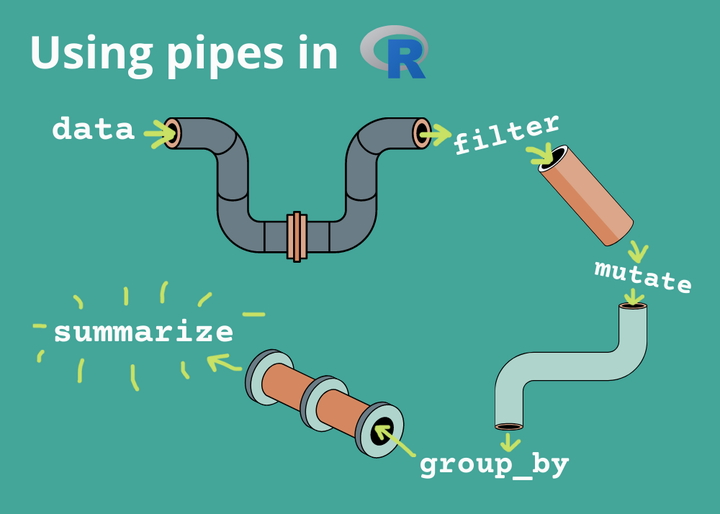

```{r}
#| label: setup
#| include: false

library(tidyverse)
library(knitr)
data("penguins", package = "datasets", envir = environment())
```

## Data transformation in R

::: {style="font-size: 90%;"}
Data visualization is a great way to explore data, but the data is rarely in exact form as needed for making graphs.
:::

::: {.fragment data-fragment-index="1" style="font-size: 90%;"}
In this presentation, we will learn how to:
:::

::: {.fragment data-fragment-index="2" style="font-size: 75%;"}

- Filter the data

- Transform existing columns and create new ones

- Group data and make grouped summary statistics

- How to make data pipelines
:::

## Data transformation in R

Illustration of the data transformation process

{fig-align="center" width="85%"}

::: {style="font-size: 50%; color: grey; text-align: center;"}
Source: Celina Cheng, _R for Ecology_
:::

## Data transformation in R

::: {style="font-size: 90%;"}
We are staying in the <kbd>tidyverse</kbd> environment using the sub-package <kbd>dplyr</kbd> {style="vertical-align: -40px;" width="8%"}
:::

::::::: columns
:::: {.column width="50%"}
::: {.fragment data-fragment-index="1" style="font-size: 70%;"}
Benefits:

- Human-readable syntax using predictable English verbs

- Intuitive piping, code as a sequence of steps

- Option to translate dplyr syntax to SQL query for databases

:::
::::

:::: {.column width="50%"}
::: {.fragment data-fragment-index="2" style="font-size: 70%;"}
Cons:

- Slower than some other packages, can't handle giant data (>1 million rows)

- Functions keep improving and updating - old code may not work
:::
::::
:::::::

## Data transformation in R

Broadly, first functions studied today can be classified into these families:

::: {.fragment data-fragment-index="2" style="font-size: 80%;"}

- Functions that operate on **rows** of a data frame

- Functions that operate on **columns** of a data frame

:::

## {.transition-slide background-color="#444444"}

::: {.transition-title}
1\) Functions that operate on ROWS
:::

## <kbd>filter()</kbd> {data-auto-animate="true"}

::: {style="font-size: 90%;" data-id="filter-intro"}
Subsets a data frame, retaining all rows that satisfy your conditions.

<span style="color: grey;">First argument</span>: data frame, <span style="color: grey;">second argument</span>: logical test
:::

```{.r data-id="filter-code"}
penguins_filtered <- filter(penguins, island == "Dream")
```

::: {style="font-size: 55%; text-align: center;" data-id="operator-table"}

| Logical operator | Meaning |
|---|---|
| `<` | Less than |
| `<=` | Less than or equal to |
| `>` | More than |
| `>=` | More than or equal to |
| `==` | Equal to |
| `!=` | Not equal to |
| `A | B` | A or B |
| `A & B` | A and B |
:::

## <kbd>filter()</kbd> {data-auto-animate="true"}

::: {style="font-size: 90%;" data-id="filter-intro"}
Subsets a data frame, retaining all rows that satisfy your conditions.

<span style="color: grey;">First argument</span>: data frame, <span style="color: grey;">second argument</span>: logical test
:::

```{.r data-id="filter-code"}
penguins_filtered <- filter(penguins, island == "Dream")
penguins_filtered_2 <- filter(penguins, flipper_len >= 190)
```

::: {style="font-size: 55%; text-align: center;" data-id="operator-table"}

| Logical operator | Meaning |
|---|---|
| `<` | Less than |
| `<=` | Less than or equal to |
| `>` | More than |
| `>=` | More than or equal to |
| `==` | Equal to |
| `!=` | Not equal to |
| `A | B` | A or B |
| `A & B` | A and B |
:::

## <kbd>filter()</kbd> {data-auto-animate="true"}

::: {style="font-size: 90%;" data-id="filter-intro"}
Subsets a data frame, retaining all rows that satisfy your conditions.

<span style="color: grey;">First argument</span>: data frame, <span style="color: grey;">second argument</span>: logical test
:::

```{.r data-id="filter-code"}
penguins_filtered <- filter(penguins, island == "Dream")
penguins_filtered_2 <- filter(penguins, flipper_len >= 190)
penguins_filtered_3 <- filter(penguins, island == "Dream" & flipper_len >= 190)
```

::: {style="font-size: 55%; text-align: center;" data-id="operator-table"}

| Logical operator | Meaning |
|---|---|
| `<` | Less than |
| `<=` | Less than or equal to |
| `>` | More than |
| `>=` | More than or equal to |
| `==` | Equal to |
| `!=` | Not equal to |
| `A | B` | A or B |
| `A & B` | A and B |
:::

## <kbd>filter()</kbd> {data-auto-animate="true"}

::: {style="font-size: 90%;"}
Subsets a data frame, retaining all rows that satisfy your conditions.

<span style="color: grey;">First argument</span>: data frame, <span style="color: grey;">second argument</span>: logical test
:::

::: {.fragment data-fragment-index="1" style="font-size: 75%;"}
- Writing many <kbd>|</kbd> and <kbd>==</kbd> can get tedious:
:::

::: {.fragment data-fragment-index="1" style="font-size: 110%;"}
```{r}
#| echo: true
#| error: true
penguins_filtered_4 <- filter(penguins, year == 2007 | year == 2008)
```
:::

::: {.fragment data-fragment-index="2" style="font-size: 75%;"}
- Useful shortcut to do the same as above: <kbd>%in%</kbd>
:::

::: {.fragment data-fragment-index="2" style="font-size: 110%;"}
```{r}
#| echo: true
#| error: true
penguins_filtered_4 <- filter(penguins, year %in% c(2007, 2008))
```
:::

## <kbd>filter()</kbd>

::: {style="font-size: 90%;"}
Subsets a data frame, retaining all rows that satisfy your conditions.

<span style="color: grey;">First argument</span>: data frame, <span style="color: grey;">second argument</span>: logical test
:::

::: {.fragment data-fragment-index="1" style="font-size: 75%;"}
Common mistakes:

-  Using <kbd>=</kbd> instead of <kbd>==</kbd>:
:::

::: {.fragment data-fragment-index="1" style="font-size: 110%;"}
```{r}
#| echo: true
#| eval: false
#| error: false
filter(penguins, year = 2007)
```
:::

::: {.fragment data-fragment-index="2" style="font-size: 110%;"}
```{r}
#| echo: false
#| eval: true
#| error: true
filter(penguins, year = 2007)
```
:::

## <kbd>filter()</kbd>

::: {style="font-size: 90%;"}
Subsets a data frame, retaining all rows that satisfy your conditions.

<span style="color: grey;">First argument</span>: data frame, <span style="color: grey;">second argument</span>: logical test
:::

::: {style="font-size: 75%;"}
Common mistakes:

-  Using "OR" statements like you would in English (will result in "silent error"):
:::

::: {style="font-size: 110%;"}
```{r}
#| echo: true
#| eval: false
#| max-height: 100px
filter(penguins, year == 2007 | 2008)
```
:::

::: {.fragment data-fragment-index="1" style="font-size: 75%;"}
This does not give a direct error, but does not evaluate the logic the way you want.
:::

::: {.fragment data-fragment-index="2" style="font-size: 110%;"}
```{r}
#| echo: false
#| eval: true
#| max-height: 100px
filter(penguins, year == 2007 | 2008)
```
:::

## <kbd>distinct()</kbd>

::: {style="font-size: 90%;"}
Keeps only unique/distinct rows from a data frame

<span style="color: grey;">First argument</span>: data frame, <span style="color: grey;">next arguments</span>: variables from the data frame for which a distinct combination is wanted
:::

::: {.fragment data-fragment-index="1"style="font-size: 110%;"}
```{r}
#| echo: true
#| eval: false
distinct(penguins, species, island)
```
:::

::: {.fragment data-fragment-index="2"style="font-size: 110%;"}
```{r}
#| echo: false
#| eval: true
options(width = 140)
distinct(penguins, species, island)
```
:::

## <kbd>count()</kbd>

::: {style="font-size: 90%;"}
Similar to <kbd>distinct()</kbd>, but rather than showing you unique instances it counts the number of occurrences

<span style="color: grey;">First argument</span>: data frame, <span style="color: grey;">next arguments</span>: variables whose unique combinations are counted
:::

::: {.fragment data-fragment-index="1" style="font-size: 110%;"}
::: {.screen-only}
```{webr-r}
#| echo: true
#| eval: true
count(penguins, species, island)
```
:::

::: {.print-only}
```{r}
#| echo: true
#| eval: true
count(penguins, species, island)
```
:::
:::

::: {.fragment data-fragment-index="2" style="font-size: 80%;"}

- Optionally, you can arrange the results in descending order using <kbd>sort = TRUE</kbd> argument.
:::

## <kbd>slice()</kbd>

::: {style="font-size: 90%;"}
Allows you to select, remove, and duplicate rows based on their (integer) location. E.g., rows 1-5, rows 20-last row, etc.

<span style="color: grey;">First argument</span>: data frame, <span style="color: grey;">second argument</span>: integers of the row location.
:::

::: {.fragment data-fragment-index="1" style="font-size: 80%;"}
- **positive** integers indicate you want to keep rows, **negative** integers indicate you want to remove rows
:::

::: {.fragment data-fragment-index="2" style="font-size: 110%;"}
```{r}
#| echo: true
#| eval: true
slice(penguins, 2:4)
```
:::

## <kbd>slice()</kbd>

::: {style="font-size: 90%;"}
Allows you to select, remove, and duplicate rows based on their (integer) location. E.g., rows 1-5, rows 20-last row, etc.

<span style="color: grey;">First argument</span>: data frame, <span style="color: grey;">second argument</span>: integers of the row location.
:::

::: {style="font-size: 80%;"}
- **positive** integers indicate you want to keep rows, **negative** integers indicate you want to remove rows
:::

::: {.fragment data-fragment-index="1" style="font-size: 110%;"}
```{r}
#| echo: true
#| eval: true
slice(penguins, -(2:4))
```
:::


## {.transition-slide background-color="#444444"}

::: {.transition-title}
2\) Functions that operate on COLUMNS
:::

## <kbd>mutate()</kbd>

::: {style="font-size: 90%;"}
Creates new or modifies existing variables in the object

<span style="color: grey;">First argument</span>: data frame, <span style="color: grey;">second argument</span>: name-value pair
:::

::: {.fragment data-fragment-index="1" style="font-size: 95%;"}
```{r}
#| echo: true
penguins_mutated <- mutate(penguins, ratio = flipper_len / body_mass)
```
:::

::: {.fragment data-fragment-index="2" style="font-size: 90%;"}
```{r}
#| echo: false
#| eval: true
options(width = 140)
head(penguins_mutated)
```
:::

## <kbd>mutate()</kbd>

::: {style="font-size: 90%;"}
Creates new or modifies existing variables in the object

<span style="color: grey;">First argument</span>: data frame, <span style="color: grey;">second argument</span>: name-value pair
:::

::: {style="font-size: 95%;"}
```{r}
#| echo: true
penguins_mutated <- mutate(penguins, ratio = flipper_len / body_mass)
penguins_mutated_2 <- mutate(penguins, body_mass_kg = body_mass / 1000)
```
:::

::: {.fragment data-fragment-index="1" style="font-size: 90%;"}
```{r}
#| echo: false
#| eval: true
options(width = 140)
head(penguins_mutated_2)
```
:::

## <kbd>mutate()</kbd>

::: {style="font-size: 90%;"}
Creates new or modifies existing variables in the object

<span style="color: grey;">First argument</span>: data frame, <span style="color: grey;">second argument</span>: name-value pair
:::

::: {style="font-size: 90%;"}
```{r}
#| echo: true
penguins_mutated <- mutate(penguins, ratio = flipper_len / body_mass)
penguins_mutated_2 <- mutate(penguins, body_mass_kg = body_mass / 1000)
penguins_mutated_3 <- mutate(penguins, size = ifelse(body_mass > 4000, "Large", "Small"))
```
:::

::: {.fragment data-fragment-index="1" style="font-size: 90%;"}
```{r}
#| echo: false
#| eval: true
options(width = 140)
head(penguins_mutated_3)
```
:::

## <kbd>select()</kbd>

::: {style="font-size: 90%;"}
Select (and optionally rename) variables in a data frame

<span style="color: grey;">First argument</span>: data frame, <span style="color: grey;">next arguments</span>: names of columns to keep or remove
:::

::: {.fragment data-fragment-index="1" style="font-size: 110%;"}
```{r}
#| echo: true
#| eval: false
select(penguins, species, bill_len, bill_dep)
```
:::

::: {.fragment data-fragment-index="2" style="font-size: 90%; max-height: 320px; overflow-y: auto;"}
```{r}
#| echo: false
#| eval: true
select(penguins, species, bill_len, bill_dep)
```
:::

## <kbd>select()</kbd>

::: {style="font-size: 90%;"}
Select/remove variables in a data frame

<span style="color: grey;">First argument</span>: data frame, <span style="color: grey;">next arguments</span>: names of columns to keep or remove
:::

::: {.fragment data-fragment-index="1" style="font-size: 80%;"}
- Useful functions that can be used as arguments of <kbd>select()</kbd>:  
<kbd>starts_with()</kbd>, <kbd>ends_with()</kbd>, and <kbd>contains()</kbd>
:::

::: {.fragment data-fragment-index="2" style="font-size: 110%;"}
```{r}
#| echo: true
#| eval: false
select(penguins, starts_with("bill"))
```
:::

::: {.fragment data-fragment-index="3" style="font-size: 90%; max-height: 200px; overflow-y: auto;"}
```{r}
#| echo: false
#| eval: true
select(penguins, starts_with("bill"))
```
:::

## <kbd>select()</kbd>

::: {style="font-size: 90%;"}
Select/remove variables (columns) in a data frame

<span style="color: grey;">First argument</span>: data frame, <span style="color: grey;">next arguments</span>: names of columns to keep or remove
:::

::: {style="font-size: 80%;"}
- Useful functions that can be used as arguments of <kbd>select()</kbd>:  
<kbd>starts_with()</kbd>, <kbd>ends_with()</kbd>, and <kbd>contains()</kbd>
:::

::: {style="font-size: 110%; max-height: 200px; overflow-y: auto;"}
::: {.screen-only}
```{webr-r}
#| echo: true
#| eval: false
select(penguins, contains("_"))
```
:::

::: {.print-only}
```{r}
#| echo: true
#| eval: false
select(penguins, contains("_"))
```
:::
:::

::: {.fragment data-fragment-index="1" style="font-size: 80%;"}
- As before, putting <kbd>-</kbd> in front of the argument will remove the specified columns
:::

## <kbd>rename()</kbd>

::: {style="font-size: 90%;"}
Rename variables in a data frame

<span style="color: grey;">First argument</span>: data frame, <span style="color: grey;">next arguments</span>: "new_name" = old_name, "new_name_2" = old_name_2, ...
:::

::: {.fragment data-fragment-index="1" style="font-size: 110%;"}
```{r}
#| echo: true
#| eval: false
rename(penguins, "bill_len_mm" = bill_len)
```
:::

::: {.fragment data-fragment-index="2" style="font-size: 90%; max-height: 200px; overflow-y: auto;"}
```{r}
#| echo: false
#| eval: true
rename(penguins, "bill_len_mm" = bill_len)
```
:::

## {.transition-slide background-color="#444444"}

::: {.transition-title}
3\) Grouping
:::


## Group & summarise data

::: {style="font-size: 85%;"}
Function <kbd>group_by()</kbd> _silently_ creates grouping of data by a specified variable

This means you will see only <kbd># Groups</kbd> added to the data frame header, nothing will change with data itself
:::

::: {.fragment data-fragment-index="2" style="font-size: 110%;"}
```{r}
#| echo: true
#| eval: false
group_by(penguins, species)
```
:::

::: {.fragment data-fragment-index="3" style="font-size: 110%; max-height: 300px; overflow-y: auto;"}
```{r}
#| echo: false
#| eval: true
group_by(penguins, species)
```
:::

## Group & summarise data

::: {style="font-size: 85%;"}
Function <kbd>summarise()</kbd> then collapses many rows into single summary value _per group_, the summary statistic can be mean, median, quartiles, etc.

If data is not grouped, the function will be used on complete data.
:::

::: {.fragment data-fragment-index="1" style="font-size: 75%;"}
- Let's first demonstrate the summarise on non-grouped data:
:::

::: {.fragment data-fragment-index="2" style="font-size: 110%;"}
```{r}
#| echo: true
#| eval: false
summarise(penguins, avg_len = mean(flipper_len))
```
:::

::: {.fragment data-fragment-index="3" style="font-size: 110%; max-height: 300px; overflow-y: auto;"}
```{r}
#| echo: false
#| eval: true
summarise(penguins, avg_len = mean(flipper_len))
```
:::

## Group & summarise data

::: {style="font-size: 85%;"}
Function <kbd>summarise()</kbd> then collapses many rows into single summary value _per group_, the summary statistic can be mean, median, quartiles, etc.

If data is not grouped, the function will be used on complete data.
:::

::: {.fragment data-fragment-index="1" style="font-size: 75%;"}
- That did not work, R does not know how to deal with <kbd>NA</kbd> values when applying summary functions
:::

::: {.fragment data-fragment-index="2" style="font-size: 75%;"}
- Ignoring <kbd>NA</kbd> values can be specified using <kbd>na.rm = TRUE</kbd> argument:
:::

::: {.fragment data-fragment-index="3" style="font-size: 110%; max-height: 300px; overflow-y: auto;"}
```{r}
#| echo: true
#| eval: true
summarise(penguins, avg_len = mean(flipper_len, na.rm = TRUE))
```
:::

## Group & summarise data

::: {style="font-size: 85%;"}
<kbd>group_by()</kbd> and <kbd>summarise()</kbd> usually work in tandem, where data is first grouped, and then summarised by group.

:::

::: {.fragment data-fragment-index="1" style="font-size: 70%;"}
- Let's pass <kbd>penguins</kbd> grouped by <kbd>species</kbd> to the <kbd>summarise()</kbd> function
:::

::: {.fragment data-fragment-index="2" style="font-size: 110%;"}
```{r}
#| echo: true
#| eval: false
summarise(group_by(penguins, species),
          avg_len = mean(flipper_len, na.rm = TRUE))
```
:::

::: {.fragment data-fragment-index="3" style="font-size: 110%;"}
```{r}
#| echo: false
#| eval: true
summarise(group_by(penguins, species),
          avg_len = mean(flipper_len, na.rm = TRUE))
```
:::

## Code readability

::: {style="font-size: 85%;"}
Our code chunks will slowly become longer and _more nested_, or we will encounter _naming issues_. Examples:
:::

::: {.fragment data-fragment-index="1" style="font-size: 90%;"}
```{r}
#| echo: true
#| eval: false
# A nested code chunk
select(
  mutate(
    filter(
      penguins,
      year >= 2008
    ),
    size = ifelse(body_mass > 4000, "large", "small")
  ),
  species, year, size
)
```
:::

::: {.fragment data-fragment-index="2" style="font-size: 90%;"}
```{r}
#| echo: true
#| eval: false
# So many similar names!
penguins_1 <- filter(penguins, year >= 2008)
penguins_2 <- mutate(penguins_1, size = ifelse(body_mass > 4000, "large", "small"))
penguins_3 <- select(penguins_2, species, year, size)
```
:::

::: {.fragment data-fragment-index="3" style="font-size: 85%;"}
Solution? **Data pipelines**
:::

## {.transition-slide background-color="#444444"}

::: {.transition-title}
4\) Pipelines
:::

## Data pipelines {data-auto-animate="true"}

::: {.fragment data-fragment-index="1" style="font-size: 85%;"}
Data pipelines are a way of changing multiple operations into a clear, readable sequence using the pipe operator: <kbd>%>%</kbd> (tidyverse) or <kbd>|></kbd> (base R).

A shortcut for writing the pipe operator is <kbd>ctrl</kbd> + <kbd>shift</kbd> + <kbd>M</kbd>. 
:::

::: {.fragment data-fragment-index="2" style="font-size: 70%;"}
- Let's demonstrate this on the previous example:
:::

::: {.fragment data-fragment-index="3"}
```{r}
#| echo: true
#| eval: false
summarise(group_by(penguins, species),
          avg_len = mean(flipper_len, na.rm = TRUE))
```
:::

::: {.fragment data-fragment-index="4" style="font-size: 70%;"}
- Same example with pipeline approach:
:::

::: {.fragment data-fragment-index="5"}
```{r}
#| echo: true
#| eval: false
penguins %>%
  filter(is.na(flipper_len) == FALSE)
```
:::

## Data pipelines {data-auto-animate="true"}

::: {style="font-size: 85%;"}
Data pipelines are a way of changing multiple operations into a clear, readable sequence using the pipe operator: <kbd>%>%</kbd> (tidyverse) or <kbd>|></kbd> (base R).

A shortcut for writing the pipe operator is <kbd>ctrl</kbd> + <kbd>shift</kbd> + <kbd>M</kbd>. 
:::

::: {style="font-size: 70%;"}
- Let's demonstrate this on the previous example:
:::

::: {style="font-size: 100%;"}
```{r}
#| echo: true
#| eval: false
summarise(group_by(penguins, species),
          avg_len = mean(flipper_len, na.rm = TRUE))
```
:::

::: {style="font-size: 70%;" data-id="pipeline-code-label"}
- Same example with pipeline approach:
:::

::: {style="font-size: 100%;"}
```{r}
#| echo: true
#| eval: false
penguins %>%
  filter(is.na(flipper_len) == FALSE) %>% 
  group_by(species, sex)
```
:::

## Data pipelines {data-auto-animate="true"}

::: {style="font-size: 85%;"}
Data pipelines are a way of changing multiple operations into a clear, readable sequence using the pipe operator: <kbd>%>%</kbd> (tidyverse) or <kbd>|></kbd> (base R).

A shortcut for writing the pipe operator is <kbd>ctrl</kbd> + <kbd>shift</kbd> + <kbd>M</kbd>. 
:::

::: {style="font-size: 70%;"}
- Let's demonstrate this on the previous example:
:::

::: {style="font-size: 100%;"}
```{r}
#| echo: true
#| eval: false
summarise(group_by(penguins, species),
          avg_len = mean(flipper_len, na.rm = TRUE))
```
:::

::: {style="font-size: 70%;" data-id="pipeline-code-label"}
- Same example with pipeline approach:
:::

::: {style="font-size: 100%;"}
```{r}
#| echo: true
#| eval: false
penguins %>%
  filter(is.na(flipper_len) == FALSE) %>% 
  group_by(species, sex) %>%
  summarise(avg_len = mean(flipper_len))
```
:::

## Data pipelines

::: {style="font-size: 80%;"}
- Let's try to get medians with interquartile ranges _per penguin species_ and _per penguin sex_
:::

::: {.fragment data-fragment-index="1"}
```{r}
#| echo: true
#| eval: false
penguins %>%
  filter(is.na(flipper_len) == FALSE & is.na(sex) == FALSE)
```
:::

## Data pipelines

::: {style="font-size: 80%;"}
- Let's try to get medians with interquartile ranges _per penguin species_ and _per penguin sex_
:::

::: {style="font-size: 100%;"}
```{r}
#| echo: true
#| eval: false
penguins %>%
  filter(is.na(flipper_len) == FALSE & is.na(sex) == FALSE) %>% 
  group_by(species, sex)
```
:::

## Data pipelines

::: {style="font-size: 80%;"}
- Let's try to get medians with interquartile ranges _per penguin species_ and _per penguin sex_
:::

::: {style="font-size: 90%;"}
```{r}
#| echo: true
#| eval: false
penguins %>%
  filter(is.na(flipper_len) == FALSE & is.na(sex) == FALSE) %>% 
  group_by(species, sex) %>% 
  summarise(median_flipper = median(flipper_len),
            q25 = quantile(flipper_len, 0.25),
            q75 = quantile(flipper_len, 0.75))
```
:::

::: {.nostretch data-fragment-index="1" style="font-size: 80%; max-height: 250px;"}
```{r}
#| echo: false
#| eval: true
penguins %>%
  filter(is.na(flipper_len) == FALSE & is.na(sex) == FALSE) %>%
  group_by(species, sex) %>%
  summarise(median_flipper = median(flipper_len),
            q25 = quantile(flipper_len, 0.25),
            q75 = quantile(flipper_len, 0.75))
```
:::


::: {.fragment data-fragment-index="2" style="font-size: 85%;"}
Important functions and concepts, let's revise briefly before moving to next topics
:::
