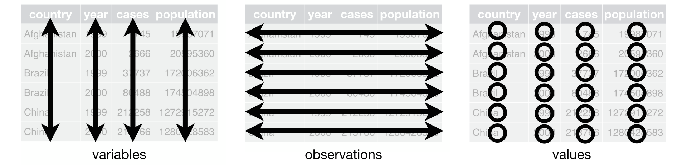
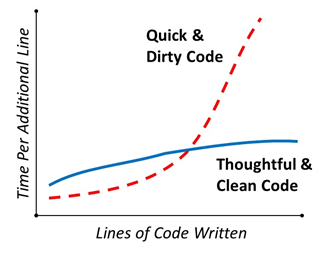

```{r}
#| label: setup
#| include: false

library(tidyverse)
library(knitr)
data("penguins", package = "datasets", envir = environment())
```

## Data tidying in R

*Happy families are all alike; every unhappy family is unhappy in its own way.* — Leo Tolstoy

*Tidy datasets are all alike, but every messy dataset is messy in its own way.* — Hadley Wickham

::: {.fragment data-fragment-index="1"}
{fig-align="center"}

<p style="font-size: 50%; color: grey; margin-top: -1em;">

Source: Hadley Wickham, *R for Data Science*

</p>
:::

## Data tidying in R

What makes a dataset **tidy**?

::: {.fragment data-fragment-index="1" style="font-size: 90%;"}
- Each **variable** represents a **column**

- Each **observation** represents a **row**

- Each **value** is a **cell**; each cell containing a single value
:::

::: {.fragment data-fragment-index="2" style="font-size: 90%;"}
- *Variable names* are descriptive: e.g. <kbd>temperature</kbd> and not <kbd>t1</kbd>

- *Missing values* are treated consistently: e.g. <kbd>NA</kbd> only, without <kbd>NULL</kbd>, <kbd>-9999</kbd>, <kbd>none</kbd>, etc.
:::

## Tidy data

Let's take a look at some example datasets that demonstrate both messy and tidy data, again coming from the <kbd>tidyverse</kbd> package:

::::: {columns}
::: {.column .fragment width="45%" data-fragment-index="1"}
```{r}
#| echo: true
#| eval: true
library(tidyverse)
table1
```
:::

::: {.column .fragment width="55%" data-fragment-index="2"}
```{r}
#| echo: true
#| eval: true
table2
```
:::
:::::

## Tidy data

Let's take a look at some example datasets that demonstrate both messy and tidy data, again coming from the <kbd>tidyverse</kbd> package:

::::: {columns}
::: {.column width="45%"}
```{r}
#| echo: true
#| eval: true
library(tidyverse)
table1
```
:::

::: {.column width="55%"}
```{r}
#| echo: true
#| eval: true
table3
```
:::
:::::

## Benefits of tidy data

- Easier data exploration

- Simplified data transformation and visualization

- Improved reproducibility

- Many R functions work easily with tidy data formats

## Data pivoting

Unfortunately, real-life datasets are messy, because:

::: {.fragment data-fragment-index="1" style="font-size: 90%;"}
- Data is usually organized with some goal in mind other than analysis, e.g. data entry, human readability, storage, ...

- Most people are not familiar with principles of tidy data
:::

::: {.fragment data-fragment-index="2"}
We will learn how to **pivot** the data into a tidy form by *lengthening* or *widening*.
:::

## Data lengthening

First, we will learn data lengthening using the <kbd>pivot_longer()</kbd> function.

::: {.fragment data-fragment-index="1"}
{fig-align="center" width="85%"}

<p style="font-size: 50%; color: grey; margin-top: -1em;">

Source: Batra, Neale, et al. *The Epidemiologist R Handbook*. 2021

</p>
:::

## Data lengthening

We will use the <kbd>billboard</kbd> dataset to demonstrate lengthening principles

::: {.fragment data-fragment-index="1"}
```{r}
#| echo: true
#| eval: true
billboard
```
:::

## Data lengthening

The <kbd>pivot_longer()</kbd> function requires minimum 3 arguments:

::: {.fragment data-fragment-index="1" style="font-size: 75%;"}
- <kbd>cols</kbd>: a vector of columns to be pivoted
:::

::: {.fragment data-fragment-index="2" style="font-size: 75%;"}
- <kbd>names_to</kbd>: a character vector which specifies the name of the new column containing column NAMES from <kbd>cols</kbd> argument
:::

::: {.fragment data-fragment-index="3" style="font-size: 75%;"}
- <kbd>values_to</kbd>: a character vector which specifies the name of the new column containing column VALUES from <kbd>cols</kbd> argument
:::

::: {.fragment data-fragment-index="4"}
```{r}
#| echo: true
#| eval: false
billboard %>%
  pivot_longer(
    cols = starts_with("wk"),
    names_to = "week",
    values_to = "rank",
    )
```
:::

## Data lengthening

Result, long data:

```{r}
#| echo: false
#| eval: true
billboard %>%
  pivot_longer(
    cols = starts_with("wk"),
    names_to = "week",
    values_to = "rank",
    )
```

::: {.fragment data-fragment-index="1" style="font-size: 85%;"}
A lot of <kbd>NA</kbd> values in the resulting data; weeks when songs were not on billboard anymore - not really useful info - let's remove them.
:::

## Data lengthening

::: {style="font-size: 85%;"}
Removing <kbd>NA</kbd> values can be done using a handy optional argument <kbd>values_drop_na</kbd>:
:::

```{r}
#| echo: true
#| eval: false
#| code-line-numbers: "6"
billboard %>%
  pivot_longer(
    cols = starts_with("wk"),
    names_to = "week",
    values_to = "rank",
    values_drop_na = TRUE
  )
```

::: {.fragment data-fragment-index="1" style="max-height: 260px; overflow-y: auto;"}
```{r}
#| echo: false
#| eval: true
billboard %>%
  pivot_longer(
    cols = starts_with("wk"),
    names_to = "week",
    values_to = "rank",
    values_drop_na = TRUE
    )
```
:::

## Data lengthening

::: {style="font-size: 85%;"}
Of course, <kbd>NAs</kbd> can also be removed using the already known <kbd>filter()</kbd> function:
:::

::::: {style="max-height: 450px; overflow-y: auto;"}
::: screen-only
```{webr-r}
#| echo: true
#| eval: true
billboard %>%
  pivot_longer(
    cols = starts_with("wk"),
    names_to = "week",
    values_to = "rank"
  ) %>%
  filter(!is.na(rank))
```
:::

::: print-only
```{r}
#| echo: true
#| eval: true
billboard %>%
  pivot_longer(
    cols = starts_with("wk"),
    names_to = "week",
    values_to = "rank"
  ) %>%
  filter(!is.na(rank))
```
:::
:::::

## Data lengthening

::: {style="font-size: 80%;"}
We can further transform the obtained long data.
:::

::: {.fragment data-fragment-index="1" style="font-size: 70%;"}
- For example, it would be useful if the <kbd>week</kbd> column would contain <kbd>1, 2, 3, ...</kbd> instead of <kbd>wk1, wk2, wk3, ...</kbd>

- Function <kbd>parse_number()</kbd>: finds the first number and keeps it, e.g. <kbd>wk12</kbd> transforms to <kbd>12</kbd>
:::

::::::: columns
:::: {.column width="45%"}
::: {.fragment data-fragment-index="2" style="font-size: 90%;"}
```{r}
#| echo: true
#| eval: false
#| code-line-numbers: "7-8"
billboard %>%
  pivot_longer(
    cols = starts_with("wk"),
    names_to = "week",
    values_to = "rank",
    values_drop_na = TRUE
  ) %>%
  mutate(week = parse_number(week))
```
:::
::::

:::: {.column width="55%"}
::: {.fragment data-fragment-index="3" style="font-size: 75%; max-height: 300px; overflow-y: auto;"}
```{r}
#| echo: false
#| eval: true
billboard %>%
  pivot_longer(
    cols = starts_with("wk"),
    names_to = "week",
    values_to = "rank",
    values_drop_na = TRUE
  ) %>%
  mutate(week = parse_number(week))
```
:::
::::
:::::::

## Data lengthening

::: {style="font-size: 80%;"}
We can further transform the obtained long data.
:::

::: {.fragment data-fragment-index="1" style="font-size: 70%;"}
- Finally, we could check how many songs stayed on top 100 billboard for more than a year (52 weeks)
:::

::::::: columns
:::: {.column width="45%"}
::: {.fragment data-fragment-index="2" style="font-size: 90%;"}
```{r}
#| echo: true
#| eval: false
#| code-line-numbers: "9-10"
billboard %>%
  pivot_longer(
    cols = starts_with("wk"),
    names_to = "week",
    values_to = "rank",
    values_drop_na = TRUE
  ) %>%
  mutate(week = parse_number(week)) %>%
  filter(week > 52) %>%
  distinct(artist, track)
```
:::
::::

:::: {.column width="55%"}
::: {.fragment data-fragment-index="3" style="max-height: 300px; overflow-y: auto;"}
```{r}
#| echo: false
#| eval: true
billboard %>%
  pivot_longer(
    cols = starts_with("wk"),
    names_to = "week",
    values_to = "rank",
    values_drop_na = TRUE
  ) %>%
  mutate(week = parse_number(week)) %>%
  filter(week > 52) %>%
  distinct(artist, track)
```
:::
::::
:::::::

## Data widening

::: {style="font-size: 90%;"}
Data widening is less common than lengthening, but is sometimes used for presentation purposes and other special cases.

Data widening is done using the <kbd>pivot_wider()</kbd> function
:::

::: {.fragment data-fragment-index="1"}
{fig-align="center" width="80%"}

<p style="font-size: 50%; color: grey; margin-top: -1em;">

Source: Batra, Neale, et al. *The Epidemiologist R Handbook*. 2021

</p>
:::

## Data widening

We will use the <kbd>Orange</kbd> dataset to demonstrate widening principles

::: {.fragment data-fragment-index="1"}
```{r}
#| echo: true
#| eval: true
Orange
```
:::

## Data widening

The <kbd>pivot_wider()</kbd> function requires at least two arguments:

::: {.fragment data-fragment-index="1" style="font-size: 75%;"}
- <kbd>names_from</kbd>: specifies the column whose values will become the new column names
:::

::: {.fragment data-fragment-index="2" style="font-size: 75%;"}
- <kbd>values_from</kbd>: specifies the column whose values will fill the new columns
:::

::: {.fragment data-fragment-index="4"}
```{r}
#| echo: true
#| eval: false
Orange %>%
  pivot_wider(
    names_from = age,
    values_from = circumference
  )
```
:::

## Data widening

Result, wide data:

```{r}
#| echo: false
#| eval: true
Orange %>%
  pivot_wider(
    names_from = age,
    values_from = circumference
  )
```

::: {.fragment data-fragment-index="1" style="font-size: 85%;"}
The column names now represent the <kbd>age</kbd> of the tree, but they are not descriptive enough for somebody else to understand what is going on.
:::

## Data widening

::: {style="font-size: 85%;"}
We can add a prefix for each new column name using the optional <kbd>names_prefix</kbd> argument:
:::

```{r}
#| echo: true
#| eval: false
#| code-line-numbers: "5"
Orange %>%
  pivot_wider(
    names_from = age,
    values_from = circumference,
    names_prefix = "age_days_"
  )
```

::: {.fragment data-fragment-index="1" style="max-height: 260px; overflow-y: auto;"}
```{r}
#| echo: false
#| eval: true
Orange %>%
  pivot_wider(
    names_from = age,
    values_from = circumference,
    names_prefix = "age_days_"
  )
```
:::

## Data widening

::: {style="font-size: 85%;"}
For complex names, we can use the optional <kbd>names_glue</kbd> argument (advanced), which uses a placeholder inside <kbd>{ }</kbd>:
:::

```{r}
#| echo: true
#| eval: false
#| code-line-numbers: "5"
Orange %>%
  pivot_wider(
    names_from = age,
    values_from = circumference,
    names_glue = "{age} [days]"
  )
```

::: {.fragment data-fragment-index="1" style="max-height: 260px; overflow-y: auto;"}
```{r}
#| echo: false
Orange %>%
  pivot_wider(
    names_from = age,
    values_from = circumference,
    names_glue = "{age} [days]"
  )
```
:::

## Tidy code

Messy code can run just as well as clean code. However, clean code makes life easier for you and others when it is revisited in the future.

{.nostretch fig-align="center" width="50%"}

::: {style="font-size: 50%; color: grey; text-align: center;"}
Source: freeCodeCamp.org
:::

## Tidy code: spacing

Use spaces on both sides of mathematical operators (<kbd>+</kbd>, <kbd>-</kbd>, etc.), assignment operators (<kbd>\<-</kbd>), and pipes (<kbd>%\>%</kbd>).

. . .

```{r}
#| echo: true
#| eval: false
# Strive for
z <- (a + b)^2 / d

# Avoid
z<-( a + b ) ^2/d
```

. . .

Do not put a space between a function name and its opening parenthesis. Put a space after commas, as in standard English.

```{r}
#| echo: true
#| eval: false
# Strive for
median(x, na.rm = TRUE)

# Avoid
median (x ,na.rm=TRUE)
```

## Tidy code: pipes

Pipes (<kbd>%\>%</kbd>) should be surrounded by spaces and typically placed at the end of a line.

. . .

```{r}
#| echo: true
#| eval: false
# Strive for
penguins %>%
  filter(!is.na(sex), !is.na(body_mass)) %>%
  count(sex)

# Avoid
penguins%>%filter(!is.na(sex), !is.na(body_mass))%>%count(sex)
```

## Tidy code: pipes

::: {style="font-size: 75%;"}
If the function you’re piping into has named arguments (like <kbd>mutate()</kbd> or <kbd>summarize()</kbd>), put each argument on a new line. If the function doesn’t have named arguments (like <kbd>select()</kbd> or <kbd>filter()</kbd>), keep everything on one line unless it doesn’t fit, in which case you should put each argument on its own line.
:::

. . .

```{r}
#| echo: true
#| eval: false
# Strive for
penguins %>%
  group_by(sex) %>%
  summarize(
    avg_mass = mean(body_mass, na.rm = TRUE),
    n = n()
  )

# Avoid
penguins %>%
  group_by(
    sex
  ) %>%
  summarize(avg_mass = mean(body_mass, na.rm = TRUE), n = n())
```

## Tidy code: pipes

Some of these rules can be relaxed if your pipeline fits easily on one line.

. . .

```{r}
#| echo: true
#| eval: false
# This fits compactly on one line
df %>% mutate(y = x + 1)

# While this takes more lines, it is easily extended to
# more variables and more steps in the future
df %>%
  mutate(
    y = x + 1
  )
```

## Tidy code: ggplot2

The same rules apply as for pipes: treat <kbd>+</kbd> the same way as <kbd>%\>%</kbd>.

```{r}
#| echo: true
#| eval: false
penguins %>%
  filter(!is.na(body_mass)) %>%
  ggplot(aes(x = body_mass, y = flipper_len)) +
  geom_point() +
  geom_smooth(
    method = "lm",
    linewidth = 0.8,
    color = "pink"
  ) +
  theme_minimal()
```

## Tidy code: sectioning

As scripts get longer, *sectioning* makes them easier to navigate.

Create a section using <kbd>Ctrl</kbd> + <kbd>Shift</kbd> + <kbd>R</kbd> on Windows or <kbd>⌘</kbd> + <kbd>Shift</kbd> + <kbd>R</kbd> on macOS.

```{r}
#| echo: true
#| eval: false
# Load data --------------------------------------

# Plot data --------------------------------------
```

## Recap

::: {style="font-size: 80%;"}
- Tidy data: one variable per column, one observation per row
- <kbd>pivot_longer()</kbd> / <kbd>pivot_wider()</kbd> to reshape data
- Clean, consistent code style makes scripts easier to read and debug
:::

# Next up

::: {style="font-size: 90%;"}
Now that we know how to visualize, transform, and tidy our data, we can start focusing on specific datasets and projects.
:::

::: {.fragment style="font-size: 100%; margin-top: 1em;"}
**Part 5 – Paths, projects, and data import**
:::
