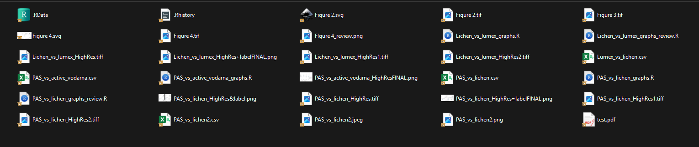
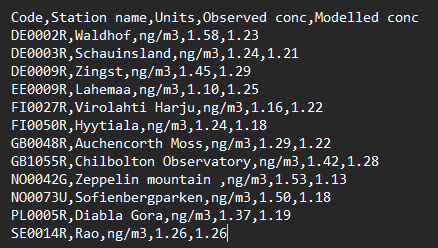
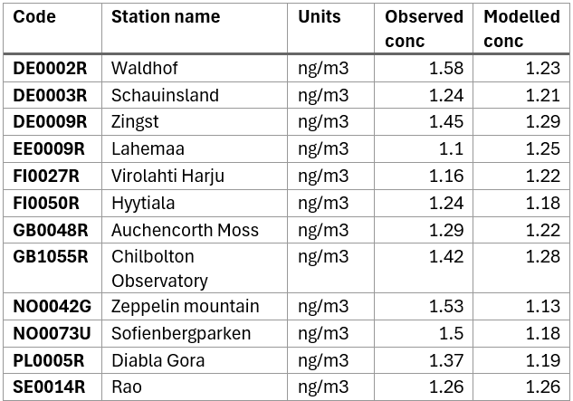

```{r}
#| label: setup
#| include: false

library(tidyverse)
library(knitr)
library(janitor)
data("penguins", package = "datasets", envir = environment())
```

## Paths

Paths are directions that tell R where to look for data or place outputs on our computer.

::: {.fragment data-fragment-index="1" style="font-size: 80%;"}
- Example Windows path: <kbd>C:\\Users\\gacnik\\Desktop</kbd>
- Example Mac path: <kbd>/Users/gacnik/Desktop</kbd>
:::

::: {.fragment data-fragment-index="2"}
R only accepts paths with forward slash character (<kbd>/</kbd>), meaning that:
:::

::: {.fragment data-fragment-index="2" style="font-size: 80%;"}
- Windows paths cannot be used as is, replacement with <kbd>/</kbd> characters
- Mac paths can be used as is
:::

## Paths

Use <kbd>getwd()</kbd> to **get** your *current* R working directory. This is where R currently looks for data and saves outputs to.

```{r}
#| echo: true
#| eval: true
getwd()
```

::: {.fragment data-fragment-index="1" style="margin-top: 1em;"}
Use <kbd>setwd()</kbd> to **set** your *new* R working directory.

```{r}
#| echo: true
#| eval: false
setwd("C:/ENTER/YOUR/PATH/HERE")
```
:::

::: {.fragment data-fragment-index="2" style="margin-top: 1em;"}
There is an easier and better way to manage paths through **RStudio projects**
:::

## Organizing your analysis project

::: {style="font-size: 85%;"}
As your data analysis skill improve, tasks become larger, and supporting files start growing.
:::

::: {.fragment data-fragment-index="1" style="font-size: 80%;"}
- We started our work in an R script, then we generated some plots, tables... if we started saving these outputs and adding new data, things could get disorganized fast:


:::

## Organizing your analysis project

::: {style="font-size: 80%;"}
Project organization for larger tasks/projects:
:::

::: {.incremental style="font-size: 75%;"}
- everything in **one project folder**, with standard **sub folders**
  - subfolders <kbd>data</kbd>, <kbd>scripts</kbd>, <kbd>outputs</kbd>, ...
- use of **RStudio project file** (<kbd>.Rproj</kbd> file)
  - relative instead of absolute paths
  - preserves specific rstudio environment and setup just for the project
:::

::: {.fragment style="font-size: 80%;"}
(Showcase the use of RStudio project)
:::

## Relative paths make projects portable

::: {style="font-size: 90%;"}
We said RStudio project uses relative paths, not absolute, what does it mean?
:::

::: {.incremental style="font-size: 80%;"}
- **Absolute path:** starts from a fixed location on one computer\
  <kbd>C:/Users/gacnik/Desktop/Example_project/data/penguins.csv</kbd>

- **Relative path:** starts from the project folder\
  <kbd>data/penguins.csv</kbd>
:::

::: {.fragment style="font-size: 80%; margin-top: 1em;"}
**Rule:** Always use relative paths in project scripts. Avoid hard-coded absolute paths: they usually break when a project is moved, shared, or opened on another computer.
:::

## Data import

Working with data already provided by R was neat, but you will need to apply the learned concept on your data.

Here, we will focus on plain-text rectangular files such as CSV, TSV, and Excel files



## Data import

Working with data already provided by R was neat, but you will need to apply the learned concept on your data.

Here, we will focus on plain-text rectangular files such as CSV, TSV, and Excel files



## Data import with a relative path

::: {style="font-size: 90%;"}
1)  Download and extract the prepared [**Example RStudio project**](https://jgacnik.github.io/Data_analysis_in_R/downloads/Example_project.zip).
:::

::: {.fragment data-fragment-index="1" style="font-size: 90%;"}
2)  Open <kbd>Example_project.Rproj</kbd>. Then import the file with <kbd>read_csv()</kbd> using a relative path:
:::

::: {.fragment data-fragment-index="1" style="font-size: 100%;"}
```{r}
#| echo: true
#| eval: false

library(tidyverse)

mercury_air <- read_csv("data/mercury_air.csv")
```
:::

::: {.fragment data-fragment-index="2" style="font-size: 80%;"}
```{r}
#| echo: false
#| eval: true
mercury_air <- read_csv("data/mercury_air.csv")
print(mercury_air, n = 7)
```
:::

## Data import

::: {style="font-size: 90%;"}
<kbd>read_csv()</kbd> function read the N/A cells as a text, not as a true <kbd>NA</kbd> value. We need to define what represents <kbd>NA</kbd> values using the <kbd>na</kbd> argument:
:::

::: {.fragment data-fragment-index="1" style="font-size: 100%; max-height: 400px; overflow-y: auto;"}
```{r}
#| echo: true
#| eval: true
mercury_air <- read_csv("data/mercury_air.csv", na = c("N/A", ""))
mercury_air
```
:::

## Data import

::: {style="font-size: 90%;"}
The names of columns have white space, and as it is annoying to manually rename each one using the <kbd>rename()</kbd> function. We can do it using the janitor package function <kbd>clean_names()</kbd>:
:::

::: {.fragment data-fragment-index="1" style="font-size: 100%; max-height: 450px; overflow-y: auto;"}
```{r}
#| echo: true
#| eval: true
mercury_air <- read_csv("data/mercury_air.csv", na = c("N/A", "")) %>% 
  clean_names()

mercury_air
```
:::

## Data import

::: {style="font-size: 90%;"}
Depending on the mess level of your data files, more arguments of <kbd>read_csv()</kbd> could be needed, for example:
:::

::: {.incremental data-fragment-index="1" style="font-size: 75%;"}
- using the <kbd>skip</kbd> argument to tell <kbd>read_csv()</kbd> how many metadata headers in files to **skip**

- using the <kbd>col_types</kbd> argument to explicitly tell <kbd>read_csv()</kbd> what type each column should be, instead of relying on guessing

- using one of <kbd>parse_number()</kbd>, <kbd>parse_date()</kbd>, <kbd>parse_time()</kbd>, ... functions to **convert values in columns to their correct type**
:::

## Import several similar files at once

::: {style="font-size: 85%;"}
The <kbd>data/</kbd> folder also contains similarly structured files per year: <kbd>mercury_air_2022.csv</kbd>, <kbd>mercury_air_2023.csv</kbd>, <kbd>mercury_air_2024.csv</kbd>
:::

::: {.fragment data-fragment-index="1" style="font-size: 85%;"}
- Let's make a vector - <kbd>c()</kbd> - of file names, and pass it to the <kbd>read_csv()</kbd>:

```{r}
#| echo: true
#| eval: false
#| message: false

mercury_files <- c("data/mercury_air_2022.csv",
           "data/mercury_air_2023.csv",
           "data/mercury_air_2024.csv")

mercury_air_all <- read_csv(mercury_files, id = "file_name")
mercury_air_all
```
:::

## Import several similar files at once

::: {style="font-size: 85%;"}
The result is a data frame which contains data from all three CSV files:
:::

::: {.nostretch style="max-height: 450px; overflow-y: auto;"}
```{r}
#| echo: false
#| eval: true
#| message: false

mercury_files <- c("data/mercury_air_2022.csv",
           "data/mercury_air_2023.csv",
           "data/mercury_air_2024.csv")

mercury_air_all <- read_csv(mercury_files, id = "file_name")
print(mercury_air_all, n = Inf)
```
:::

## Data export

::: {style="font-size: 85%;"}
*Data export* or *data writing* is the reverse process of data import. Data can be saved to CSV or TSV using <kbd>write_csv()</kbd> and <kbd>write_tsv()</kbd>, respectively.
:::

::: {.fragment fragment-index="1" style="font-size: 85%;"}
- Two arguments are used: <kbd>x</kbd> - data frame to be saved, and <kbd>file</kbd> - the location where to save it:
:::

::: {.fragment fragment-index="1" style="font-size: 100%;"}
```{r}
#| echo: true
#| eval: false
write.csv(mercury_air_all, "outputs/mercury_air_all.csv")
```
:::

::: {.fragment fragment-index="2" style="font-size: 85%; margin-top: 1.5em;"}
Note that the file was saved into the <kbd>outputs</kbd> sub directory of our project directory

- Handy for saving text file outputs, figures, models, or any other output results.
:::

## Data entry

::: {style="font-size: 85%;"}
Sometimes we need to make a table "by hand" using <kbd>data.frame()</kbd>. This can be done by data entry in your R script, although it is not recommended for larger data.
:::

::: {.fragment fragment-index="1" style="font-size: 85%;"}
- The layout follows this structure: column_name1 = c(value1, value2, value3), column_name2 = c(value4, value5, value6), ... = ...
:::

::: {.fragment fragment-index="1" style="font-size: 100%;"}
```{r}
#| echo: true
#| eval: false
data.frame(
  x = c(1, 2, 4),
  y = c("dog", "cat", "pig"),
  z = c(0.02, 0.05, 0.08)
)
```
:::

::: {.fragment fragment-index="2" style="font-size: 100%;"}
```{r}
#| echo: false
#| eval: true
data.frame(
  x = c(1, 2, 4),
  y = c("dog", "cat", "pig"),
  z = c(0.02, 0.05, 0.08)
)
```
:::

<!-- COURSE RECAP START -->

## Part 1 · Introduction (1/2)

::::::: columns
:::: {.column width="50%"}
**Work in a script**

::: {style="font-size: 75%;"}
- Run the current line with <kbd>Ctrl</kbd> + <kbd>Enter</kbd>
- Use <kbd>\#</kbd> comments to explain **why**
- Use <kbd>?function_name</kbd> when you need help
- Read errors from the first line and check brackets, commas, and spelling
:::
::::

:::: {.column width="50%"}
**Think in functions and objects**

::: {style="font-size: 75%;"}
- Functions perform actions: <kbd>mean(x)</kbd>
- Arguments control them: <kbd>mean(x, na.rm = TRUE)</kbd>
- <kbd>\<-</kbd> stores a result in an object
- Clear names make later steps easier to follow
:::
::::
:::::::

## Part 1 · Introduction (2/2)

:::::: columns
::: {.column width="55%"}
```{r}
#| echo: true
#| eval: false
# Install once; load each session
install.packages("tidyverse")
library(tidyverse)

mass <- c(4200, 3900, 4600)
mean_mass <- mean(mass)
```
:::

:::: {.column width="45%"}
::: {style="font-size: 72%;"}
- A vector contains values of one basic type
- A data frame organizes vectors into columns
- Use <kbd>object\[row, column\]</kbd> to subset a data frame
- Installing adds a package; loading makes its functions available
- Reassigning an existing name overwrites the object
:::
::::
::::::

## Part 2 · Visualization (1/2)

::: {style="font-size: 85%;"}
**Data** → **aesthetic mappings** → **geometric layers**
:::

:::::: columns
::: {.column width="56%"}
```{r}
#| echo: true
#| eval: false
ggplot(
  data = penguins,
  mapping = aes(
    x = body_mass,
    y = flipper_len,
    color = species
  )
) +
  geom_point()
```
:::

:::: {.column width="44%"}
::: {style="font-size: 72%;"}
- Put variables inside <kbd>aes()</kbd>
- Put fixed choices outside <kbd>aes()</kbd>
- Add layers with <kbd>+</kbd>
- Choose a geometry that answers the question
- Add labels and a theme only after the plot communicates clearly
:::
::::
::::::

## Part 2 · Visualization (2/2)

:::::: columns
:::: {.column width="50%"}
::: {style="font-size: 75%;"}
**What do you want to see?**

- One numeric variable → histogram or density plot
- Numeric values across groups → boxplot
- Two numeric variables → scatter plot
- Patterns within groups → color, shape, or facets
:::
::::

::: {.column width="50%"}
```{r}
#| echo: true
#| eval: false
penguins %>%
  ggplot(aes(
    x = body_mass,
    y = flipper_len,
    color = species
  )) +
  geom_point() +
  facet_wrap(~ sex) +
  labs(
    x = "Body mass (g)",
    y = "Flipper length (mm)"
  ) +
  theme_minimal()
```
:::
::::::

::: {.fragment style="font-size: 75%; margin-top: 0.6em; width: 82%;"}
Save the final plot with <kbd>ggsave()</kbd>; set its filename, size, and resolution.
:::

## Part 3 · Data transformation (1/2)

::: {style="font-size: 72%;"}
| Goal | Main verbs |
|------------------------------------|------------------------------------|
| Keep rows | <kbd>filter()</kbd>, <kbd>slice()</kbd>, <kbd>distinct()</kbd> |
| Work with columns | <kbd>select()</kbd>, <kbd>rename()</kbd>, <kbd>mutate()</kbd> |
| Count observations | <kbd>count()</kbd> |
| Calculate by group | <kbd>group_by()</kbd> + <kbd>summarise()</kbd> |
:::

::: {.fragment style="font-size: 80%; margin-top: 0.8em; width: 82%;"}
**Before summarising:** check missing values; use <kbd>na.rm = TRUE</kbd> when removal is appropriate.
:::

## Part 3 · Data transformation (2/2)

```{r}
#| echo: true
#| eval: false
penguins %>%
  filter(!is.na(sex), !is.na(body_mass)) %>%
  mutate(body_mass_kg = body_mass / 1000) %>%
  group_by(species, sex) %>%
  summarise(
    mean_mass_kg = mean(body_mass_kg),
    n = n(),
    .groups = "drop"
  )
```

::: {.fragment style="font-size: 78%; margin-top: 0.8em; width: 82%;"}
Read top to bottom: **start with data**, then add one clear step per line.
:::

## Part 4 · Data tidying (1/2)

::::::: columns
:::: {.column width="52%"}
::: {style="font-size: 82%;"}
- Each **variable** is a column
- Each **observation** is a row
- Each **value** is one cell
:::
::::

:::: {.column width="48%"}
::: {style="font-size: 75%;"}
Tidy data makes it easier to:

- transform with <kbd>dplyr</kbd>
- visualize with <kbd>ggplot2</kbd>
- compare observations
- reuse code across variables and groups
:::
::::
:::::::

## Part 4 · Data tidying (2/2)

::::: columns
::: {.column width="50%"}
**Wide → long**

```{r}
#| echo: true
#| eval: false
billboard %>%
  pivot_longer(
    cols = starts_with("wk"),
    names_to = "week",
    values_to = "rank",
    values_drop_na = TRUE
  )
```
:::

::: {.column width="50%"}
**Long → wide**

```{r}
#| echo: true
#| eval: false
Orange %>%
  pivot_wider(
    names_from = age,
    values_from = circumference,
    names_prefix = "age_days_"
  )
```
:::
:::::

::: {.fragment style="font-size: 72%; margin-top: 0.6em; width: 82%;"}
Use consistent spacing and indentation; break long pipelines and named arguments across lines.
:::

## Part 5 · Paths, projects, and data import

:::::: columns
::: {.column width="48%"}
``` text
my_project/
├─ my_project.Rproj
├─ data/
├─ scripts/
└─ outputs/
```
:::

:::: {.column width="52%"}
::: {style="font-size: 75%;"}
- Open the <kbd>.Rproj</kbd> file before working
- Keep inputs, scripts, and outputs in predictable folders
- Use relative paths such as <kbd>data/file.csv</kbd>
- Avoid paths tied to one person or computer
- Treat original data as read-only
:::
::::
::::::

::: {.fragment style="font-size: 80%; margin-top: 0.8em; width: 82%;"}
**Test:** move the project folder; the scripts should still run.
:::

# Final project

::: {style="font-size: 90%;"}
We have covered the core R concepts. Now, let's use a real environmental dataset to demonstrate a complete data-analysis workflow in R.

:::

::: {.fragment style="font-size: 100%; margin-top: 1em;"}
**Final – project demo**
:::
