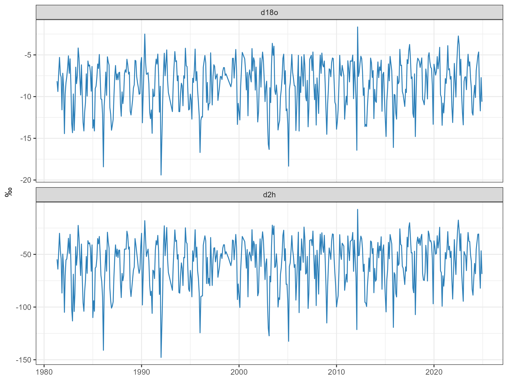

## One project, five parts

::: {style="font-size: 90%;"}
In this final demonstration, we will connect the main skills from the workshop in one reproducible analysis.
:::

::: {.fragment data-fragment-index="1" style="font-size: 85%;"}

1. Import and inspect data
2. Select, rename, and filter
3. Group and summarise
4. Reshape and visualise
5. Model and save results

:::

::: {.fragment data-fragment-index="2" style="font-size: 80%;"}
Follow the slides, but run each section in <kbd>scripts/project_demonstration_new.R</kbd> in RStudio.
:::

## The demonstration data

:::: {.columns}

::: {.column width="48%"}
{.nostretch fig-align="center" width="100%"}
:::

::: {.column width="52%"}
::: {style="font-size: 76%;"}
We will analyse <kbd>precipitation_ljubljana.xlsx</kbd>:

- monthly precipitation measurements from Ljubljana;
- 44 years of observations, from 1981 to 2024;
- precipitation amount, temperature, humidity, and isotope values;
- several Excel sheets containing data and supporting information.
:::
:::

::::

## Start inside the project

::: {style="font-size: 85%;"}
Extract <kbd>example_project.zip</kbd> and open <kbd>example_project.Rproj</kbd>. Then open the demonstration script.
:::

::: {.fragment data-fragment-index="1" style="font-size: 90%;"}
```text
example_project/
├── data/
│   └── precipitation_ljubljana.xlsx
├── scripts/
│   └── project_demonstration_new.R
└── outputs/
```
:::

::: {.fragment data-fragment-index="2" style="font-size: 80%;"}
The project makes relative paths such as <kbd>data/...</kbd> work on every computer.
:::

## 1. Import and inspect

::: {style="font-size: 78%;"}
Run sections 1 and 2. This recalls **objects, functions, packages, and data frames**.
:::

```{r}
#| eval: false
#| echo: true
library(tidyverse)
library(readxl)

ljubljana_raw <- read_xlsx(
  "data/precipitation_ljubljana.xlsx",
  sheet = "Data Ljubljana"
)

glimpse(ljubljana_raw)
head(ljubljana_raw)
```

## 2. Prepare the data

::: {style="font-size: 78%;"}
Run section 3. Keep only the variables needed for the analysis and give them clear names.
:::

```{r}
#| eval: false
#| echo: true
ljubljana_clean <- ljubljana_raw %>%
  select(Year, Month, P, T, RH, d18O, d2H) %>%
  rename(
    year = Year,
    month = Month,
    precipitation_mm = P,
    d18o = d18O,
    d2h = d2H
  ) %>%
  mutate(date = lubridate::make_date(year, month, 1))

isotope_data <- ljubljana_clean %>%
  filter(!is.na(d18o), !is.na(d2h))
```

## 3. Group and summarise

::: {style="font-size: 78%;"}
Run section 4. Change the level of observation from **one month** to **one year**.
:::

```{r}
#| eval: false
#| echo: true
annual_summary <- ljubljana_clean %>%
  group_by(year) %>%
  summarise(
    months_with_isotopes = sum(!is.na(d18o) & !is.na(d2h)),
    mean_d18o = mean(d18o, na.rm = TRUE),
    mean_d2h = mean(d2h, na.rm = TRUE),
    annual_precipitation_mm = sum(precipitation_mm, na.rm = TRUE),
    .groups = "drop"
  )

head(annual_summary)
```

## 4. Reshape for plotting

::: {style="font-size: 78%;"}
Run section 5. Put both isotope measurements into the same pair of columns.
:::

```{r}
#| eval: false
#| echo: true
isotopes_long <- isotope_data %>%
  select(date, d18o, d2h) %>%
  pivot_longer(
    cols = c(d18o, d2h),
    names_to = "isotope",
    values_to = "isotope_value"
  )
```

::: {.fragment data-fragment-index="1" style="font-size: 78%;"}
Each row now contains one date, one isotope name, and one measured value: **tidy data**.
:::

## 5. Visualise

::: {style="font-size: 78%;"}
Run section 6. The long data make it easy to use the same plot design for both isotopes.
:::

```{r}
#| eval: false
#| echo: true
isotope_time_plot <- isotopes_long %>%
  ggplot(aes(x = date, y = isotope_value)) +
  geom_line(color = "#2C7FB8", linewidth = 0.5) +
  facet_wrap(~ isotope, ncol = 1, scales = "free_y") +
  labs(
    title = "Precipitation isotopes through time",
    x = NULL,
    y = "Isotope value"
  ) +
  theme_minimal()

print(isotope_time_plot)
```

## 6. Model and save

:::: {.columns}

::: {.column width="50%"}
::: {style="font-size: 76%;"}
Run section 7 to describe the relationship between the two isotopes.

```{r}
#| eval: false
#| echo: true
isotope_model <- lm(
  d2h ~ d18o,
  data = isotope_data
)

summary(isotope_model)
```
:::
:::

::: {.column width="50%"}
::: {style="font-size: 76%;"}
Run section 8 to save results in the project.

```{r}
#| eval: false
#| echo: true
write_csv(
  annual_summary,
  "outputs/annual_isotope_summary.csv"
)

ggsave(
  "outputs/isotopes_through_time.png",
  isotope_time_plot
)
```
:::
:::

::::

## Your turn

::: {style="font-size: 88%;"}
Run the full script from top to bottom. Then make **one small change**:
:::

::: {.fragment data-fragment-index="1" style="font-size: 82%;"}

- analyse only observations from 2000 onwards;
- change a colour or label in one plot; or
- add one more statistic to <kbd>annual_summary</kbd>.

:::

::: {.fragment data-fragment-index="2" style="font-size: 82%;"}
Re-run the affected sections and check the <kbd>outputs</kbd> folder.
:::

## A complete, reproducible workflow

::: {style="font-size: 88%;"}
The demonstration joined the workshop parts into one script:
:::

::: {.fragment data-fragment-index="1" style="font-size: 82%;"}

- **Part 1:** objects, data frames, functions, and missing values
- **Part 2:** plots and a simple linear model
- **Part 3:** selecting, filtering, grouping, and summarising
- **Part 4:** tidy data and reshaping
- **Part 5:** projects, relative paths, importing, and exporting

:::

::: {.fragment data-fragment-index="2" style="font-size: 85%;"}
Because the inputs, code, and outputs stay together, the analysis can be repeated and shared.
:::
